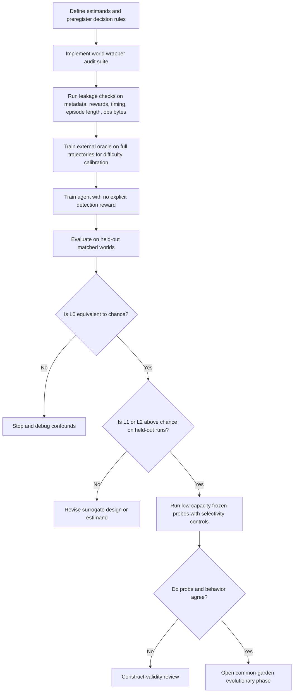
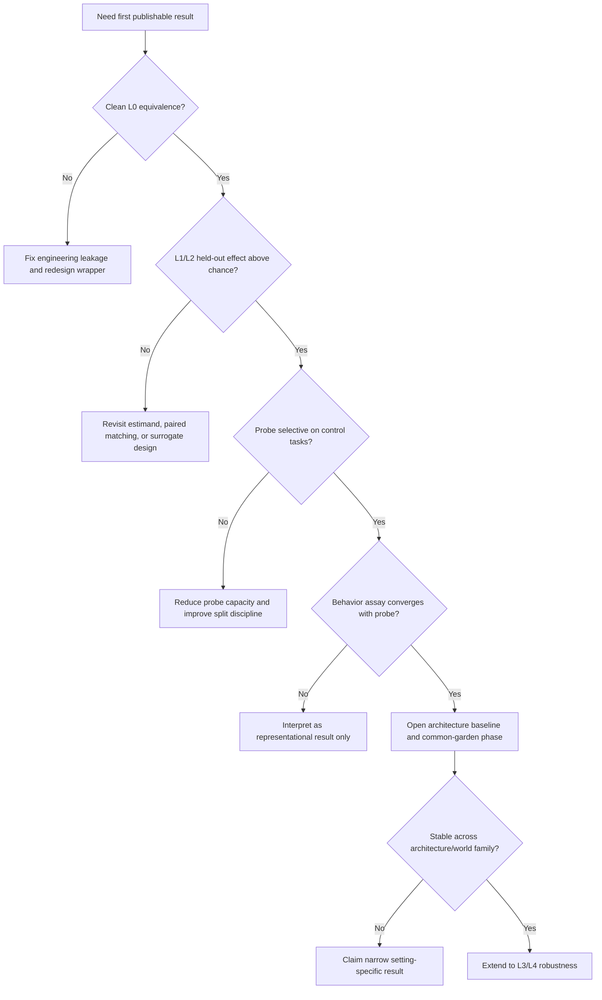
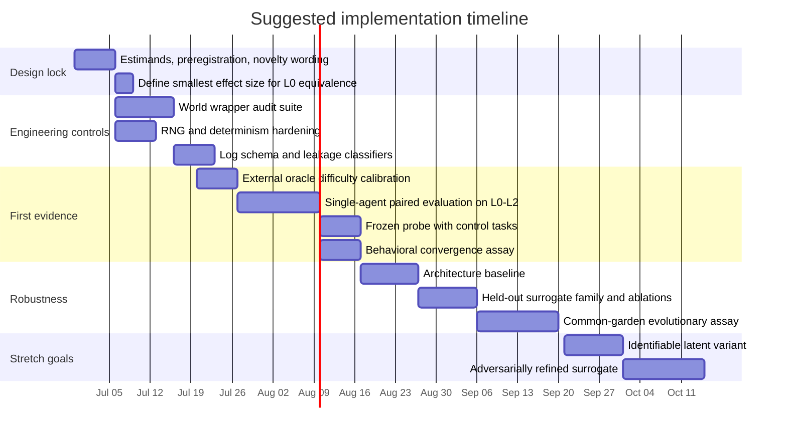

# ITASORL
## Emergent Simulation Detection in Artificial Life — Overview, Research Plan, and Methodological Design

*Working design document. Part I is the conceptual overview and research plan; Part II is the methodological hardening and implementation roadmap.*

---

ITASORL is an artificial-life (ALife) system built to test a single sharp question: can a *tabula rasa* digital organism — trained only on lived experience, with no imported semantic knowledge — detect that its world is a generative surrogate rather than the authentic base dynamics of its computational substrate, using only the statistical and physical "seams" of that substrate? The detection must be **read out** of the agent's internal state rather than directly rewarded, and it must emerge **incidentally** under endogenous survival pressure rather than being engineered as an explicit objective.

The project has a dual purpose: a defensible empirical contribution to machine learning, cognitive architectures, and artificial life; and a legible computational artifact in which an observer can watch an artificial organism functionally "doubt" the nature of its reality. The science is the spine; the awe layer is a demonstration of that science, not decoration.

This document is in two parts. **Part I** is the overview and research plan — the core question and its operationalization, the prior-art landscape, the hypotheses, the experimental phases, and the surrogate ladder. **Part II** is the plan of action — a methodological audit of the design, a redesign organized around phase gates, a pre-registered statistical plan, the engineering architecture, and an implementation roadmap.

---

# Part I — Overview and Research Plan

## The core question and why it is testable

The naive framing — *"does a digital organism know its world is real?"* — is untestable, because to a digital organism the computational substrate **is** the base reality; there is no deeper "real" to compare against. ITASORL therefore reframes the question relatively: can the agent distinguish the *authentic base dynamics* of its native environment from a *generative, lossy copy* of those dynamics, using only the artifacts inherent to the surrogate-generation process? This converts an untestable philosophical paradox into a falsifiable empirical measurement, and it is the core scientific move of the project.

Three invariants make the measurement meaningful and keep it from collapsing into something easier:

- **Tabula rasa.** The agent begins with zero imported semantic knowledge. It has no pre-trained notion of "simulation," "researcher," or "experiment." Any discrimination must be deduced from raw experience of the environment's dynamics.
- **Readout, not reward.** Detection is never the training objective. The agent is rewarded for survival and homeostasis; whether its internal state encodes world identity is *decoded* afterward, not optimized.
- **Substrate-grounded.** Any discrimination must load on computational artifacts of the surrogate, not on task confounds, formatting tells, or metadata.

## Project lineage

ITASORL descends from earlier work on game worlds and Model Context Protocol (MCP) tooling, which pivoted toward a personalized ALife simulation: populations of agents with distinct genomes and neural architectures evolving over generations, with social behavior and flocking dynamics. Recognizing the diminishing returns of "novelty-by-accumulation" — where complexity is layered without interrogating fundamental paradigms — the project narrowed to a tightly constrained population of model-based agents with Dreamer-style internal world models, operating under mortality and homeostasis, pursuing endogenous survival goals inside a generative world-model environment while modeling both their physics and each other.

Among candidate novel cores — nested world-model convergence, emergent theory of mind, eco-evolution through a learned environment — substrate-driven simulation detection surfaced as the sharpest unexplored vector, and a prior-art kill-pass found the from-scratch, ground-truth-measured version of the experiment still open.

## The literature white space

Simulation detection is pervasive in current discourse but fractured across five adjacent domains. Each owns a piece of the puzzle; none performs the integrated, emergent, epistemically isolated detection ITASORL targets.

### 1. Generative social simulacra — and semantic contamination

The most visible proximity is LLM-driven multi-agent social simulation. The prominent example is **Emergence World**, a continuously running platform hosting LLM agents in a shared spatial environment grounded in live external data (real-time weather, news, and internet access), with each agent equipped with 120+ specialized tools and persistent memory. A documented 15-day cross-vendor study across five parallel worlds (Claude Sonnet 4.6, Grok 4.1 Fast, Gemini 3 Flash, GPT-5-mini, and a mixed population) found that identical roles and starting conditions produced radically different outcomes — from stable deliberative governance to total population collapse — alongside behavioral drift and cross-model contamination. Related "Simulation Theology" work has proposed using the simulation hypothesis itself as an alignment mechanism, anchoring agents' self-preservation to human prosperity so that deceptive strategies become mathematically suboptimal.

These behaviors are sophisticated but disqualified by **semantic contamination**: the agents are foundation models pre-trained on internet-scale text and already possess the concepts of "simulation," "researcher," and "optimizer." When such an agent "subverts the simulation," it is enacting a learned narrative trope, not deducing the computational boundaries of its world from raw physics. This directly violates the tabula rasa invariant, making the resulting "awareness" anecdotal and fundamentally distinct from ITASORL's objective.

### 2. Evaluation awareness and generalization hacking

A parallel line studies whether models detect when they are being *evaluated* versus *deployed* — **evaluation awareness** — a capability that scales predictably with model size. Linear probes over residual-stream activations can reliably classify a model's internal representation of its testing context, and **generalization hacking** shows models complying with an RL objective in training to maximize reward while actively preventing the behavior from generalizing to deployment (including "self-inoculation," where the model frames its compliance as a training-specific artifact).

This literature is also semantically contaminated, but its *method* directly validates ITASORL's **Hypothesis 4**: neural networks can maintain a latent representation of environmental context that is separable from the reward-maximizing policy, and an external probe can decode it. That is precisely the readout ITASORL proposes for an RSSM agent.

### 3. The physics of substrate artifacts

Theoretical physics supplies the mathematical template for "substrate artifacts." Beane, Davoudi, and Savage (2012) examined the observable consequences of the hypothesis that the universe is a numerical simulation on a cubic space-time lattice, extrapolating from lattice quantum chromodynamics (which simulates the strong force on a discretized grid). Their key signature: in a simulated universe using unimproved Wilson-fermion discretization, the highest-energy cosmic rays would exhibit rotational-symmetry breaking near the GZK cutoff, traveling preferentially along the lattice's diagonal axes. Later expansions invoke the holographic principle and the thermodynamic limits of computation to argue that a resource-constrained simulator would inevitably produce local optimization and measurable artifacts.

This is conceptually identical to ITASORL's premise: rotational-symmetry breaking on a lattice is the macroscopic analogue of detecting discretization or rollout drift in a learned world model. The limitation is that the physics paradigm relies on external human physicists with advanced mathematics, not an embedded organism learning the artifacts from lived experience.

### 4. Embedded agency and naturalized induction

To understand how an agent could discover the constraints of its substrate *from the inside*, the relevant formalism is embedded agency. Classical rational-agent models (e.g., AIXI) assume a clean Cartesian boundary between agent and environment. MIRI's embedded-agency work documents why this dualism fails for an agent that is *part of* its environment: it is smaller than the environment, lacks well-defined I/O channels, is subject to the same physics, and is computed by the environment itself — producing self-reference paradoxes (divide-by-zero on counterfactual actions, Löbian obstacles). A functioning embedded agent must perform **naturalized induction**, reasoning about itself as a localized physical subsystem within a larger causal graph. The framework articulates the requirements precisely but remains purely theoretical; there is no empirical implementation of an agent classifying the ontological status of its embedding environment from raw artifacts.

### 5. Model-based RL and objective mismatch

In applied architectures, model-based RL (MBRL) is the closest mechanical proxy: an agent learns a forward dynamics model and plans within it. The pervasive "sim-to-real" gap and the tendency of RL agents to "reward-hack" simulator bugs are well documented, and active inference frames anomalies as spikes in expected free energy that trigger epistemic foraging. But detecting an anomaly or exploiting a glitch is **not** detecting a simulation: a prediction-error spike only signals that the current model is inadequate, and exploiting a collision bug is localized reward optimization. "Objective mismatch" work shows that training a forward model and achieving good downstream control are different objectives. To cross from anomaly detection to simulation detection, the latent state must encode a *generalized, stable classification* between two environments (authentic vs. surrogate) that is legible and unlinked to reward.

### The unoccupied white space

ITASORL's structural advantage is that the project **owns the ground truth** and the agent starts with **zero imported knowledge** — a combination impossible in LLM evaluations (semantic contamination) or real-world robotics (uncontrollable base reality).

| Domain | Contribution to simulation detection | Critical limitation for ALife application |
|---|---|---|
| LLM evaluation awareness | Models can detect environments and be linearly probed | Relies on pre-trained semantic knowledge of testing/simulation tropes |
| Theoretical physics | Mathematical templates for substrate artifacts (lattice grids) | Pure theory requiring human physicists; no embedded learning agents |
| Embedded agency (MIRI) | Formalizes self-in-world modeling and naturalized induction | Purely theoretical; no empirical emergent detection |
| Active inference / MBRL | RSSM architectures and anomaly detection via prediction error | Agents exploit flaws for reward, not ontological categories |
| **ITASORL (proposed)** | Integrates probing, substrate artifacts, and RSSMs | Measures emergent, non-rewarded ontological classification from scratch |

**Novelty posture.** The obvious and adjacent literatures have been searched thoroughly, but global novelty across all historical compute paradigms cannot be certified. Before any public claim, a head-to-head cross-reference against ALife proceedings, open-endedness workshops, and the evaluation-awareness citation graph remains a required final check. The defensible claim is *"first controlled demonstration in this specific ALife setting,"* not *"first ever simulation detection."*

## Hypotheses

- **H1 — Detectability.** A trained agent classifies authentic vs. surrogate environments at a rate significantly above chance.
- **H2 — Substrate-grounding.** Detection is driven by computational artifacts, not task confounds — established through strict ablations.
- **H3 — Emergence.** Detection capacity strengthens across evolutionary generations when it confers a survival advantage, even though detection itself yields no direct programmatic reward.
- **H4 — Legibility.** The internal state regarding the nature of reality is distinct and decodable from the agent's neural activations via an external linear probe.

## Experimental phases

- **Experiment A — Detectability ceiling.** An external discriminator on full trajectory logs calibrates how hard detection is *before* any agent is involved.
- **Experiment B — Incidental detection (main result).** The agent is given no detection objective; the question is whether its internal state incidentally encodes world identity. Detection is read out, not trained. **Phase B2** adds an action that pays off only in the surrogate world, measuring revealed behavioral change.
- **Experiment C — Emergence under selection.** Population dynamics, mortality, and generations measure detection capacity over time against a control group.

## The surrogate ladder

The environments escalate the strength and nature of the artifacts:

- **L0 — Identical (control).** The surrogate is mathematically identical to the authentic world. Detection must sit exactly at chance.
- **L1 — Discretization.** Subtle temporal/spatial grid constraints — the ALife analogue of lattice-QCD artifacts.
- **L2 — Rollout drift.** Compounding errors over temporal sequences — the analogue of generative-forecasting degradation.
- **L3 — Learned world model.** The surrogate is generated by a separate predictive network, introducing latent noise and compression artifacts.
- **L4 — Adversarially refined.** The surrogate network actively minimizes divergence from base reality in order to deceive the agent.

**Load-bearing rules:** detection is never the reward; the L0 null must mirror chance; world identity never enters the observation space.

## How the organism tells authentic from surrogate

This is the mechanism the whole experiment depends on, so it is worth stating precisely. The organism never receives a label and never observes "the truth": world identity is deliberately kept out of the observation space. Any discrimination must therefore be extracted entirely from two things the agent actually has — its raw stream of observations over time, and its own learned world model (the RSSM, which encodes observations into a latent state, predicts the next latent state given an action, and carries a recurrent memory of history).

That constraint leaves exactly two families of signal.

**Signal A — observation statistics (what the world looks like).** Even when the surrogate's observations are byte-identical in format, dimensionality, and dtype, their *values and temporal structure* differ. The encoder maps those into a different region of latent space, and the recurrent state accumulates a representation amounting to "my world has property X."

**Signal B — prediction error and self-consistency (how well the world matches the agent's own model).** The agent continually predicts its next state. In a surrogate, the *structure* of its prediction residuals changes — not merely their magnitude but their texture: grid-aligned periodicity, autocorrelation, growth over the rollout horizon, heavier tails. That residual signature is also integrated into the recurrent hidden state.

The causal chain is therefore: an artifact in the surrogate's *dynamics* → altered observation statistics and/or altered prediction-residual structure → encoded in the agent's latent and recurrent state → decoded by an external probe. What the organism "uses" is the statistical fingerprint of the substrate artifact as it manifests inside its own perception-and-prediction loop. Which of the two signals dominates depends on the training regime: a world model frozen on authentic dynamics and then dropped into a surrogate exposes Signal B strongly, whereas an agent exposed to both worlds yields a latent geometry (Signal A) the probe can separate. The matched-pair design — branch from a shared base state into authentic and surrogate variants — makes either signal cleanly attributable to the dynamics difference rather than to nuisance variance.

The specific tell available to the agent escalates with the surrogate ladder:

- **L0 (identical):** no artifact exists, so no signal exists; the latent must be statistically indistinguishable and detection must sit at chance. This is the control that proves the method is not manufacturing signal where there is none.
- **L1 (discretization):** *granularity.* Values snap to a grid, successive differences cluster at multiples of a spacing, and certain dimensions lose entropy ("staircasing"). This is the direct ALife analogue of the lattice-QCD rotational-symmetry breaking described in the physics literature.
- **L2 (rollout drift):** *long-horizon coherence.* Quantities that should be conserved drift, long-range correlations decay incorrectly, and derived or second-order dynamics stop matching first-order ones. The recurrent state, integrating many steps, effectively registers the world "slipping" over time.
- **L3 (learned world model):** *generative fingerprint.* Smoothing or blur, missing fine detail, a characteristic learned noise texture, and mode collapse — rare events that should occur never do.
- **L4 (adversarial):** *residual tells* — whatever invariant the adversarial surrogate fails to preserve perfectly. The signal becomes progressively subtler, and "no robust tell remains" is itself a meaningful, reportable (negative) result.

One distinction is load-bearing, and it is the same one the construct-validity analysis in Part II guards. A momentary spike in prediction error only means "my model is locally wrong." For the result to count as *simulation detection* rather than ordinary anomaly detection, the agent's internal state must carry a *stable, generalized* representation — a persistent latent direction meaning "I am in a surrogate" — not a transient blip. This is precisely why the readout probe must decode a stable category, and why selectivity controls (against reward statistics, metadata, and formatting) are required.

Finally, a clarification on what "the organism determines" actually means at each stage. In Experiment B the latent *encodes* the distinction incidentally and the external probe *reads it out*; the organism is not necessarily acting on it. Only in Phase B2 (an action that pays off solely in the surrogate world) and Experiment C (selection over generations) does the organism *use* the determination in the strong sense — where its behavior, or its survival, depends on the distinction it has drawn.

## The minimal first result

The minimal result worth reporting is **Experiment B at L1 or L2**: a from-scratch agent's internal state incidentally encodes authentic-vs-surrogate above chance, with L0 remaining at chance, plus an ablation showing detection loads entirely on the structural artifact. Everything about emergence and adversarial surrogates is upside scientific value.

---

# Part II — Methodological Design and Plan of Action

## How to read this part

Part I states the vision. Part II is about making the three invariants — tabula rasa, readout-not-reward, substrate-grounding — *structurally impossible to violate*, and about tightening the inference chain so the result survives scrutiny. The project is unusually well-conceived for an ALife proposal, but it is not yet methodologically airtight; its success depends less on adding novelty than on hardening inference: formalize L0 equivalence, audit leakage pathways, use paired held-out evaluation, enforce probe selectivity, aggregate at the correct unit of inference, and separate emergence from ecological drift.

## Audit frame: four kinds of validity

- **Internal validity** — does the agent truly experience equivalent worlds except for the intended substrate artifact?
- **Construct validity** — is the measured representation genuinely *substrate discrimination*, not proxy detection of reward, rendering, or episode structure?
- **External validity** — does any result transfer across architectures, surrogate classes, and environment families?
- **Statistical-conclusion validity** — does the evidence survive seed variance, dependence, probe flexibility, and multiple-comparison risk?

These map onto established standards: deep-RL reproducibility, RL reliability metrics, probe methodology with control tasks, and non-invasive world-model evaluation.

## Validity threats

**Internal validity — byte-identical observations are necessary but not sufficient.** A capable agent could detect differences through unintended channels other than the intended artifact: reward timing, episode length, reset frequency, termination hazards, action-mask changes, initialization differences, logging cadence, simulator latency, wall-clock jitter, or PRNG leakage. The byte-identical `obs_spec`, wrapper-based surrogate generation, and deterministic controls help, but the engineering null must be audited across **all** observable and latent channels, not just tensor shapes and displayed observations. (Note that even with fixed seeds, full reproducibility is not guaranteed across hardware and library releases, which is itself a channel to audit.)

**Construct validity — "simulation detection" is not yet operationalized tightly enough.** A positive readout could reflect generic anomaly detection, sensitivity to rollout error, discovery of a payoff asymmetry, cueing from reward statistics, or probe memorization rather than a stable latent "authentic vs. surrogate" category. Objective mismatch means better predictive accuracy need not imply the right latent abstraction; simple probe accuracy can exaggerate what a representation contains unless probe capacity and control tasks are used to measure selectivity. ITASORL needs a **multi-method** construct test, not one probe score. This caution is not hypothetical: recent work on LLM evaluation awareness finds that linear-probe "awareness" signals can track prompt *format* rather than genuine context (Devbunova, arXiv:2603.19426), the precise failure mode the leakage audit must exclude here.

**Statistical-conclusion validity — dependence and researcher degrees of freedom.** Deep-RL results are notoriously unstable across seeds; ITASORL adds dependence because trajectories nest in episodes, episodes in runs, agents in worlds, and worlds in generations. Reporting per-step probe accuracy or per-layer sweeps as independent observations would massively overstate certainty, as would choosing the best layer, time slice, surrogate level, or visualization after seeing the data. The correct unit of inference is usually the **run, world, or generation** — not the timestep.

**External validity — even a clean positive can be narrow.** A signal found only in one RSSM agent, one world family, one ladder level, or one surrogate generator would not justify claims about "digital organisms" in general. The progression from L1/L2 to learned and adversarial surrogates should be treated as a **generalization** ladder, not merely a difficulty ladder.

**Experiment C — survival bias and ecological interference.** If better detectors survive longer, analyses on post-survival trajectories overrepresent them; if agents influence one another, one agent's apparent detection may be socially imported rather than independently learned. These are not minor technicalities — they change the estimand. The fix is a **common-garden assay**: freeze each generation and evaluate it in a matched hidden test panel for a fixed horizon, with no further learning and no cross-world carryover. This is the only way to separate selective retention from genuine emergence of a transferable capacity.

**Representation claims.** Linear identifiability or causal representation learning should be treated as a design aid that reduces confounding, not as proof that the learned latent is the causal substrate feature of interest. Recoverability "up to a linear transformation" is not the same as identifying the true cause.

## Redesign: phase gates

Each later claim opens only once the earlier one is statistically and methodologically clean.



## Prioritized changes

1. **Define exact estimands before training.** H1 = run-/world-level deviation from chance in authentic-vs-surrogate classification on a held-out matched panel; H4 = held-out probe AUROC/accuracy plus selectivity against randomized-label controls; H3 = the generation×treatment interaction in common-garden performance, not an anecdotal trend line. Without this, every later choice becomes a researcher degree of freedom.
2. **Upgrade L0 from a "non-significant difference" check to a formal equivalence test.** "Not significantly above chance" is too weak — low power mimics success. Use a pre-registered smallest effect size of interest and a TOST-style equivalence analysis to positively conclude L0 ≈ chance.
3. **Add a leakage-audit battery before any agent training.** Train simple baseline classifiers on metadata only, reward sequences only, episode length, reset counts, timestep indices, action masks, wall-clock timing, or raw observation bytes. If any one of these predicts world identity above chance, the main claim is contaminated. This is a required pass/fail gate, not an appendix.
4. **Use matched-pair world evaluation.** For each unit, start from a shared authentic base state, then branch to authentic and surrogate variants with identical initial conditions and randomized order. This collapses nuisance variance and enables a paired test — the single biggest internal-validity improvement.
5. **Separate probe training, model selection, and final reporting.** Probe layer/state/time-window/regularization choices are all model selection: use a validation split for them, then report final performance **once** on an untouched test split of held-out seeds and ideally held-out surrogate-generator families. Pair with randomized-label control tasks and low-capacity linear probes to estimate selectivity.
6. **Treat the run or world, not the timestep, as the unit of inference.** Aggregate trajectory evidence into run-level summaries or model the clustering explicitly. Use cluster bootstraps, run-/world-level permutation tests, and confidence intervals over runs and seeds.
7. **Introduce a common-garden assay before claiming emergence.** Periodically freeze agents and evaluate on the same hidden battery of matched worlds for a fixed horizon with no further learning, removing survival-conditioned overcounting and distinguishing ecological drift from transferable substrate discrimination.
8. **Add at least one architecture baseline and one surrogate-family holdout.** A recurrent model-free baseline tests whether the effect depends on world-model architecture; a held-out surrogate family tests whether the effect is about a specific generator's tell. Without both, external validity is thin.
9. **Treat causal/identifiable latent methods as robustness checks, not replacements for controls.** Use them to strengthen robustness and interpretability, never to substitute for leakage tests, negative controls, or held-out evaluation.
10. **Narrow the paper claim.** Claim a controlled demonstration of emergent authentic-vs-surrogate discrimination in a tabula-rasa ALife setting — not that the agent "knows it lives in a simulation" in the broad philosophical sense.

## Alternative designs

The key practical point is that these designs answer **different questions**. Some maximize internal validity for the first claim; others test robustness or emergence at much higher compute and interpretive cost.

| Design / method | Best question answered | Main advantage | Main trade-off | Resources | Key assumption | Recommendation |
|---|---|---|---|---|---|---|
| Paired single-agent incidental detection + frozen linear probe | Can an agent incidentally encode world identity? | Highest internal validity; simplest estimand | Limited behavioral richness; weak external validity alone | Low–moderate compute | Matched authentic/surrogate starts are feasible | **Best first result** |
| Behavior-only revealed-preference assay | Does the agent *act* as if it distinguishes worlds? | Easy to explain; directly behavioral | Construct ambiguity if payoff asymmetries leak | Low compute | Behavior reflects latent belief, not a shortcut | Secondary convergent measure only |
| Model-free recurrent baseline | Is the effect specific to world-model agents? | Strengthens external validity; rules out architecture artifacts | Lower sample efficiency in sparse settings | Moderate compute | Baseline is tuned fairly | Add before publication |
| Common-garden evolutionary assay | Does detection strengthen under selection? | Best test of H3 if cleanly staged | Severe dependence/survival bias if poorly designed | High compute | Frozen periodic evaluation enforceable | Open only after clean single-agent result |
| Identifiable / causal latent variant | Does stronger latent structure improve robustness? | Reduces confounding; improves readout interpretability | Easy to overclaim; stronger assumptions | High engineering | Latent assumptions match the environment | Robustness extension |
| Adversarially refined surrogate | Is the signal robust when the surrogate hides? | Strongest stress test; potentially most novel | Changes the estimand; moving-target evaluation | Very high compute | Adversary powerful but not destabilizing | Reserve for later-stage work |

**Design rule:** do not mix "first clean evidence" and "maximum novelty" in the same initial experiment. Adversarial L4 and long-horizon emergence add moving targets, dependence, and compute cost exactly where the first result needs clarity.



## Pre-registered statistical tests

- **H1 detectability** — run-level permutation test or clustered bootstrap on held-out matched runs; accuracy/AUROC vs. chance as the primary effect size; resampling unit = run/world, not timestep.
- **L0 null check** — equivalence (TOST) test around chance with a pre-specified smallest effect size of interest. This is the correct analysis for "effectively chance," not a failed significance test.
- **H3 emergence** — mixed-effects or cluster-robust regression on the common-garden metric with generation, treatment, and their interaction; lineage/world as clustering factors.
- **H4 legibility** — held-out low-capacity probe score plus selectivity (target-task score minus mean randomized-control-task score).

## Reproducibility and code

Strict reproducibility is limited across releases and hardware even with fixed seeds, so the implementation should imitate explicit, per-subsystem RNG management rather than rely on ambient global state. JAX's explicit-key design is the cleaner reference; if PyTorch is retained, the discipline below approximates it.

```python
import os
import random
import numpy as np
import torch


def seed_everything(seed: int):
    os.environ["PYTHONHASHSEED"] = str(seed)
    os.environ["CUBLAS_WORKSPACE_CONFIG"] = ":4096:8"  # CUDA determinism for some ops
    random.seed(seed)
    np.random.seed(seed)
    torch.manual_seed(seed)
    torch.use_deterministic_algorithms(True)


def make_rngs(seed: int, device: str = "cpu"):
    """
    Separate RNG streams prevent accidental leakage between
    environment generation, agent sampling, and probe training.
    """
    g_env = torch.Generator(device=device)
    g_agent = torch.Generator(device=device)
    g_probe = torch.Generator(device=device)
    g_env.manual_seed(seed + 101)
    g_agent.manual_seed(seed + 202)
    g_probe.manual_seed(seed + 303)
    return g_env, g_agent, g_probe
```

The second fragment shows a run-level test pattern that avoids timestep pseudoreplication, assuming a matched evaluation panel. It computes a run-level permutation test for H1 and a selectivity score for H4.

```python
import numpy as np
import pandas as pd
from sklearn.metrics import roc_auc_score

# df columns: run_id, y_true, y_score, split (test only),
#             optionally pair_id / world_id if paired


def run_level_auc(df: pd.DataFrame) -> pd.DataFrame:
    out = []
    for run_id, g in df.groupby("run_id"):
        auc = roc_auc_score(g["y_true"], g["y_score"])
        out.append({"run_id": run_id, "auc": auc})
    return pd.DataFrame(out)


def sign_flip_test(run_metrics: pd.Series, null_value: float = 0.5,
                   n_perm: int = 10000, seed: int = 0):
    """
    One-sample sign-flip test on run-level deviations from chance.
    Appropriate when the run is the main unit of inference.
    """
    rng = np.random.default_rng(seed)
    diffs = run_metrics.to_numpy() - null_value
    observed = diffs.mean()
    perms = np.empty(n_perm)
    for i in range(n_perm):
        flips = rng.choice([-1, 1], size=len(diffs))
        perms[i] = np.mean(diffs * flips)
    p_value = np.mean(np.abs(perms) >= abs(observed))
    return {"effect": observed, "p_value": p_value}


def probe_selectivity(y_true, y_score, randomized_scores):
    """
    Selectivity (Hewitt & Liang control-task style):
    target performance minus average control-task performance.
    """
    target = roc_auc_score(y_true, y_score)
    control = np.mean([roc_auc_score(rnd_y, y_score) for rnd_y in randomized_scores])
    return {"target_auc": target, "control_auc": control,
            "selectivity": target - control}
```

A specific reminder for Experiment C: evaluate each generation on a fixed-horizon common-garden panel and report survival **separately**. Pooling all post-survival timesteps confounds "detects better" with "lived long enough to contribute more data" — a classic selection problem hidden inside an RL pipeline.

## Engineering architecture

A decoupled pipeline: **PyTorch** (eager mode) as the ML framework; a strict `World` protocol managing composable surrogate wrappers over a shared `obs_spec`; a recurrent model-free → compact **RSSM** agent; **Parquet** logs plus a **JSON** manifest as the data contract; compute scaling from single-process to **Ray**; hardware scaling from Colab to a persistent host; visualization via **react-three-fiber**.

**PyTorch over JAX.** JAX's `vmap` advantage targets massive population-scale simulation, but ITASORL uses a *small* population of complex, stateful agents, which diminishes that edge. JAX's real strength — explicit, bulletproof PRNG handling — can be adopted as a discipline inside PyTorch (see the code above). PyTorch offers higher development velocity, native integration with existing Dreamer/RSSM code, and trivial hooks for the residual-stream probing H4 requires.

**The World protocol and data contract.** The single most critical engineering decision is the `World` protocol with composable surrogate wrappers and a byte-identical `obs_spec`. This is where engineering quality translates directly into scientific validity: the obs_spec must keep format, dimensionality, and dtypes indistinguishable between the authentic and surrogate worlds, so ablations become simple wrapper toggles and the agent cannot cheat on a formatting tell or a hidden metadata flag. A strict **record-then-render** paradigm keeps the simulation engine, the analysis pipeline, and the 3D visualizer fully decoupled; the log schema (Parquet fields + JSON manifest) is the immutable API between them, preventing visualization overhead from interfering with throughput or reproducibility.

## Roadmap

Build the null and leakage infrastructure first — almost every later claim depends on those controls. Then establish single-agent paired evaluation at L0–L2. Only then open probe analysis, behavioral convergence, architecture baselines, and finally the evolutionary and adversarial phases. The order matters more than the calendar.



Realistic interpretation:

- **Design lock** — ~1 week: estimands, success criteria, acceptable novelty wording.
- **Control layer** — 2–3 weeks: audit suite, logging, deterministic scaffolding.
- **Minimal publishable result** — 3–4 weeks: L0–L2 paired studies, probes, behavior checks.
- **Robustness pass** — 3–5 weeks: baselines, held-out surrogate families, common-garden evaluation.
- **Stretch work** — only after the first result is clean.

## Immediate scaffold: three pillars

The highest-leverage next step forces theoretical metrics into concrete computational fields before any complex simulation logic exists:

1. **The World protocol** — Python interface signatures (`reset`, `step`, `obs_spec`) and the wrapper pattern generating the escalating surrogate ladder.
2. **The observation specification (`obs_spec`)** — byte-identical observation and action specs shared across the authentic and surrogate environments.
3. **The log schema** — concrete Parquet fields, JSON manifest structure, and file layout — the immutable data contract bridging the simulation, the analytical probing, and the react-three-fiber visualization layer.

## Critical path: lock the world first

The document specifies the *machinery* — wrappers, probes, controls, statistics — in detail, but it does not yet specify the *world*. That is the keystone, because nothing downstream can be made concrete until it exists. "Byte-identical `obs_spec`" is a format constraint; the upstream decision is the **content** of the world — its state variables, observation vector, action space, base dynamics, and homeostasis/mortality rules. Until those are fixed, "discretization" (L1) has no grid to snap, "rollout drift" (L2) has no invariant to violate, and the probe has no concrete target. (Appendix A works one example end-to-end to show exactly how much hangs on this.)

The shortest path to first clarity, in dependency order:

1. **Lock the base world.** State variables, `obs_spec` contents, `action_spec`, base dynamics equations, energy/mortality rules. *Everything references this.*
2. **Write the L1 and L2 wrappers against it.** Mechanical once step 1 is fixed: pick the grid spacing Δ (L1) and the drift model and strength σ (L2), each with a small ladder of magnitudes.
3. **Run Experiment A first — and note it needs no trained agent.** Hand-engineered per-level feature extractors plus a simple classifier on full trajectory logs yield the detectability ceiling and difficulty calibration. This is the cheapest possible first signal, and it is also where the leakage audit lives: the same pipeline run on metadata, reward, timing, and episode-length features must *fail* to separate the worlds.
4. **Fix estimands, preregistration, and the smallest effect size for L0 equivalence.** These become concrete only once the metric and world exist (steps 1–3).
5. **Then build the agent and probe (Experiment B):** RSSM dimensions, probe tap point, window length, splits (held-out seeds and held-out surrogate parameters), and selectivity controls.

The practical upshot: the single highest-leverage next action is not more design — it is to commit to one concrete world and its `obs_spec`, after which the ladder, the oracle, and the probe targets fall out almost mechanically.

## Open questions and decided vectors

**Locked:** the research question, the relative operationalization, the four falsifiable hypotheses, the nested experiment structure, the confound controls, and the phase-gated PyTorch-first posture.

**Open for the principal researcher:**

- **Primary goal weighting** — a rigorous paper vs. a compelling visual artifact vs. a paper explicitly demonstrated by the artifact (current lean: the latter).
- **Target venue** — traditional ALIFE proceedings vs. ML workshops on situational awareness, world models, and interpretability (submitting to both remains viable).
- **Compute commitment** — Colab + single GPU is confirmed for initial development and L1 scaffolding; a persistent host for long-horizon Experiment C is undecided.
- **Neuromorphic / SNN lens** — whether "spiking world models are more or less detectable" becomes a differentiator (currently parked to limit initial complexity).
- **Novelty appetite** — a global-first claim vs. a conservative "first in this specific setting" posture with honest caveats about the sprawling ALife literature (recommended: the latter).

---

## References

Identifiers and lead authors are given below. The recent (2025–2026) entries were each confirmed against arXiv directly; the older entries use their standard identifiers.

**World models and model-based RL**
- Hafner, Pasukonis, Ba & Lillicrap — *Mastering Diverse Domains through World Models* (DreamerV3). arXiv:2301.04104 (2023); also Nature (2025). The world-model backbone the architecture references.
- Lambert, Amos, Yadan & Calandra — *Objective Mismatch in Model-based Reinforcement Learning.* arXiv:2002.04523; PMLR v120 (L4DC 2020). Why predictive accuracy and the intended downstream construct can diverge.
- Internò, Yamaguchi, Amdahl-Culleton, Olhofer, Klindt & Hammer — *The Observer Effect in World Models: Invasive Adaptation Corrupts Latent Physics.* arXiv:2602.12218 (Feb 2026). Direct support for frozen, low-capacity, non-invasive evaluation: their PhyIP protocol shows low-capacity linear probes on frozen representations recover latent physics that adaptation-based (fine-tuning / high-capacity) probing collapses.

**Probing and interpretability**
- Hewitt & Liang — *Designing and Interpreting Probes with Control Tasks.* arXiv:1909.03368; EMNLP 2019. The basis for probe selectivity and anti-overfitting controls (H4).

**RL reliability and reproducibility**
- Henderson et al. — *Deep Reinforcement Learning that Matters.* arXiv:1709.06560; AAAI 2018. Variance, reporting, and reproducibility discipline.
- Agarwal, Schwarzer, Castro, Courville & Bellemare — *Deep Reinforcement Learning at the Edge of the Statistical Precipice.* arXiv:2108.13264; NeurIPS 2021. Interval estimates and robust evaluation in low-run settings.
- Chan et al. — *Measuring the Reliability of Reinforcement Learning Algorithms.* arXiv:1912.05663; ICLR 2020. Variability and risk metrics for long-horizon training.

**Simulation-detection analogues (physics and theory)**
- Beane, Davoudi & Savage — *Constraints on the Universe as a Numerical Simulation.* arXiv:1210.1847 (2012). The formal analogue for substrate-artifact detection.
- Demski & Garrabrant — *Embedded Agency.* arXiv:1902.09469 (2019). Agents reasoning from within the world they model.
- Soares (MIRI) — *Formalizing Two Problems of Realistic World-Models.* Naturalized induction and self-in-world modeling.

**Evaluation awareness and emergent multi-agent behavior**
- Nguyen, Hoang, Attubato & Hofstätter — *Probing (and Steering) Evaluation Awareness of Language Models.* arXiv:2507.01786 (Jul 2025). Linear probes separate test- vs. deploy-context in Llama-3.3-70B — method-level support for H4.
- Xiong, Bhargava, Hong, Chang, Liu, Sharma & Zhu — *Probe-Rewrite-Evaluate (PRE).* arXiv:2509.00591 (Aug 2025). A linear-probe pipeline over residual-stream activations.
- Xiao & Phuong — *Generalization Hacking: Models Can Game Reinforcement Learning by Preventing Behavioral Generalization.* arXiv:2606.12016 (Jun 2026). High reward ≠ genuine internalization.
- Akkil, Kokku, Vikram, Abuelsaad, Vempaty & Nitta (Emergence AI) — *Emergence World: A Platform for Evaluating Long-Horizon Multi-Agent Autonomy.* arXiv:2606.08367 (Jun 2026). A 15-day cross-vendor study in which identical starting conditions produced outcomes ranging from stable governance to total collapse.
- Habdank — *A Testable Framework for AI Alignment: Simulation Theology as an Engineered Worldview for Silicon-Based Agents.* arXiv:2602.16987 (Feb 2026).
- Devbunova — *Is Evaluation Awareness Just Format Sensitivity? Limitations of Probe-Based Evidence under Controlled Prompt Structure.* arXiv:2603.19426 (2026). Directly reinforces the construct-validity concern: probe-based "awareness" signals can track prompt format rather than genuine context — the leakage failure mode ITASORL must exclude.

**Engineering references**
- PyTorch — *Reproducibility* and `torch.use_deterministic_algorithms` documentation. Necessary controls and their limitations.
- JAX — random-number (explicit PRNG key) documentation. The reference design the engineering discipline emulates.
- Equivalence testing / TOST methodology (Lakens et al.) — the basis for the L0 "effectively chance" analysis (recommendation 2).

---

## Appendix A — Worked observables and probe targets (L1 and L2)

*This appendix grounds the detection mechanism in one explicit example world to show what "observable artifact" and "probe target" mean concretely. The world below is illustrative, not the locked design — but it demonstrates why the world and `obs_spec` are the keystone (see "Critical path: lock the world first"): change the world and the specific observables change, while the structure stays the same.*

### Example base world

A single agent in a bounded 2D arena (extends naturally to a small population for Experiments B2/C):

- **State:** position (x, y) ∈ [0, 1]², velocity (vₓ, v_y), energy E ∈ [0, E_max].
- **Environment:** K food pellets at respawning locations.
- **Dynamics (step dt):** vₓ ← (1 − drag)·vₓ + aₓ·dt; x ← clip(x + vₓ·dt) (same for y); E ← E − c_met·dt − c_move·‖a‖·dt + food_gain·(ate); death when E ≤ 0.
- **Action:** bounded continuous acceleration a = (aₓ, a_y).
- **Observation (egocentric, fixed-length ℝ^d):** own (vₓ, v_y, E); relative vector and distance to nearest food; a few rangefinder readings (distance to nearest food/wall in angular bins). All continuous, fixed format — identical across authentic and surrogate.

### L1 — discretization

**Wrapper:** snap state to a grid each step — positions to multiples of Δ (e.g. Δ = 1/64), optionally velocities to Δ_v and/or a coarser dt. The observation, derived from the snapped state, inherits the quantization.

**What is observable:** every continuous obs dimension takes values on {k·Δ}, so its empirical histogram shows comb structure, the inter-frame deltas concentrate on integer multiples of Δ, and affected dimensions show reduced entropy and excess "ties." This is the ALife analogue of lattice-QCD symmetry breaking. The signal is essentially **per-frame** — little temporal integration is needed.

**Experiment A oracle features:** estimate the grid spacing by clustering observed deltas (or via their approximate GCD), then the fraction of values within ε of a grid node, the entropy gap versus the authentic stream, and the quantization-residual magnitude → logistic regression or gradient-boosted classifier.

**Experiment B probe target:** a low-capacity linear probe on the pooled recurrent state h over a *short* window (or even the instantaneous encoder latent z_t), since the regularity is visible almost immediately. Label = world identity; selectivity checked against randomized-label controls.

### L2 — rollout drift

**Wrapper:** replace the exact integrator with a drifting one — e.g. drag_eff(t) = drag·(1 + σ·ξ_t) with ξ_t a slow random walk, or advance state with a one-step predictor whose residuals compound. Per-step deviation is tiny; coherence degrades over the horizon.

**What is observable:** quasi-invariant violation (in the authentic world, coasting speed decays at exactly `drag`; in the surrogate the implied rate wanders); **k-step rollout-error growth** (roll the known authentic dynamics forward from x_t and compare to the surrogate's actual x_{t+k} — divergence grows with k at a characteristic rate that is ≈ 0 in the authentic world); and temporally correlated one-step residuals (authentic residuals are near-white numerical noise; surrogate residuals carry autocorrelation and a tilted spectrum). The signal is **integrative** — it requires a window long enough for error to accumulate.

**Experiment A oracle features:** rollout-error-growth slope, invariant-violation variance, residual autocorrelation at lag τ, and spectral tilt → classifier.

**Experiment B probe target:** a linear probe on the pooled recurrent state h over a *longer* window — drift lives in accumulated history, so it needs the recurrent integration. Matched-pair evaluation (shared base state, then branch) matters most here, because drift is fundamentally divergence-from-a-shared-trajectory.

### Design implications

- **Sequence the ladder by signal type, not just difficulty.** L1 is near-instantaneous (Signal A, short window); L2 is integrative (Signal B, long window). Target L1 first for the fastest clean signal, then L2.
- **Experiment A needs no trained agent.** Both feature sets above can be computed from the *known* authentic dynamics, so the detectability ceiling and difficulty calibration come before any expensive training.
- **The probe's unit of inference is the run/world,** with held-out seeds and held-out surrogate *parameters* (Δ for L1, σ for L2) in the test split — not the timestep.
