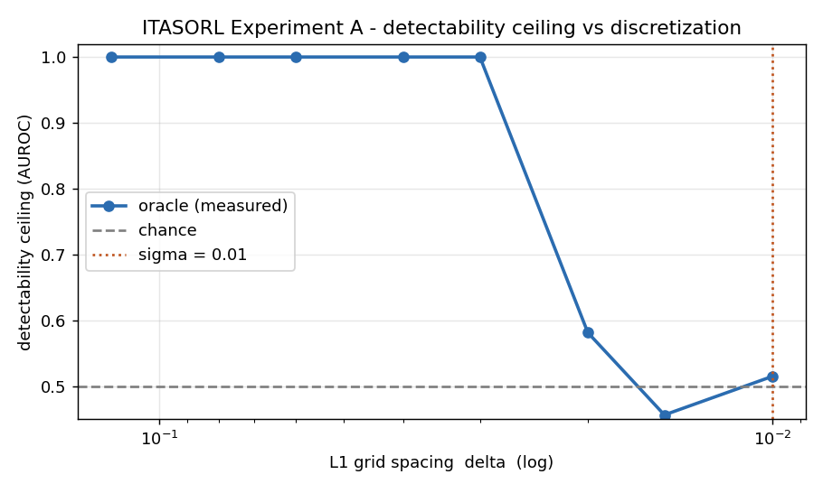
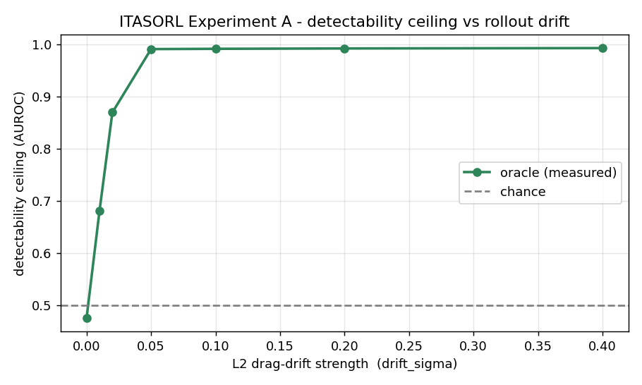
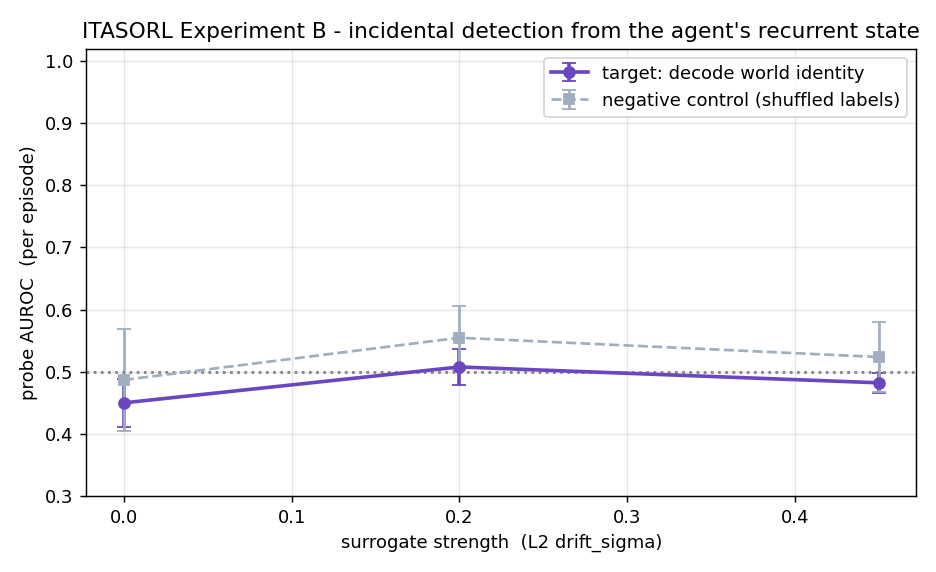
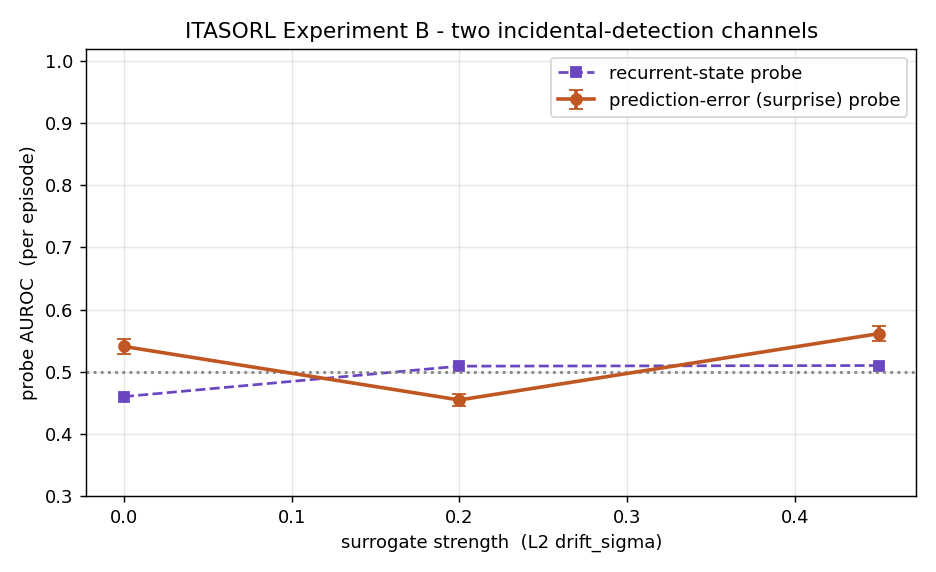
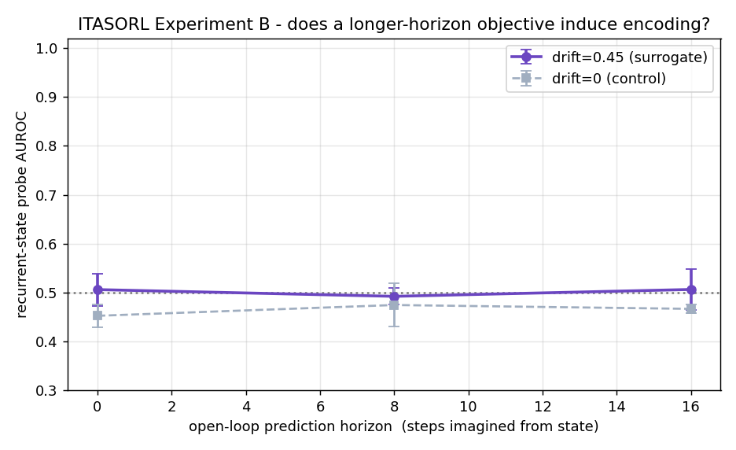

# ITASORL: Findings to Date

*Empirical results from the first build-and-test cycle. This document records what
was run and what was found; the research plan lives in `ITASORL.md` and the world
in `ITASORL_world_spec.md`.*

*Section numbers are stable identifiers: frozen pre-registration documents cite
them, so result sections are appended, never renumbered. (The one exception: the
reproducibility appendix, cited nowhere frozen, moved from 8 to 12 to restore
reading order; there is deliberately no section 8.)*

---

## TL;DR

We built a tabula-rasa digital world with a controllable "surrogate ladder" and
asked whether a from-scratch agent can tell that its world is a generative
surrogate rather than the authentic base dynamics, using only substrate seams,
with detection **read out, not rewarded**.

**There are two headline results, one negative and one positive, and the contrast
between them is the finding.**

**At L2 (a hand-tuned dynamics artifact), detectability does not imply incidental
encoding: a robust, well-controlled negative below the pre-registered bar.** A
substrate artifact that an external, privileged oracle detects almost perfectly
(AUROC ≈ 0.99, measured in Experiment A's tamed diagnostic configuration - no
in-config oracle ceiling exists for the Experiment-B world, unlike L3's in-config
gate) leaves essentially no decodable trace in a from-scratch agent's learned
representation (AUROC ≈ 0.5), across three readout channels, surviving engagement
and probe checks (linear *and* nonlinear). Under survival pressure at scale the
picture is graded rather than flat: the survival-coupled variant reaches 0.610
(90% CI [0.585, 0.634]) at n = 10 - below the 0.65 encoding bar, i.e. the
pre-committed *intermediate zone*, but significantly above both same-trunk
baselines (≈ +0.10 over predictor and untrained), so a small survival-specific
L2 trace exists without clearing the bar. A supervised reference run that trains
the trunk directly on the drift reaches a pooled 0.596 (90% CI [0.577, 0.616]) -
a lower-bound positive control on what the pooled readout can express (its
supervision only partially succeeded; matched-pair 0.702), not a proven
architectural ceiling (sections 3, 4, 9).

**At L3 (a learned-dynamics fingerprint surrogate), survival-trained agents do
incidentally encode world identity: a controlled, partly behavior-mediated
positive.** With the oracle-calibrated fingerprint (gate AUROC 0.928, untrained
floor at chance), the survival agent's state decodes the world at **0.752**
(t-based 90% CI [0.698, 0.807], excluding the bar; n = 10 seeds), while the
predictor (0.573) and untrained (0.488) baselines on the identical trunk do not.
Reward leakage, survivorship, and nonlinear-probe controls pass; a strict
per-timestep behavior control leaves a behavior-independent world-signal of
**0.726** (90% CI [0.685, 0.765], 9/10 seeds above the bar; section 10; widening
that control to also residualize absolute position and heading holds it at 0.723,
section 10.4.1). A
pre-registered replication at a second oracle-calibrated capacity (hidden = 7)
splits the claim: the behavior-independent world-signal replicates almost exactly
(**0.722**, CI clearing the bar), but the survival-vs-predictor dissociation was
not demonstrated (survival 0.737 vs predictor 0.714; the paired difference +0.023
misses the pre-registered +0.05 rule, and its 90% CI [-0.026, +0.071] includes
both 0 and the SESOI - so absence of a dissociation at hidden = 7 is not
established either, though the hidden-8-sized effect of +0.18 is excluded), so
the survival-*specific* part of the claim is conditional on the subtler
hidden = 8 artifact (section 10.5).

Together: an agent does not represent a detectable artifact *for free* (L2), but
when the artifact is a generative fingerprint that survival pressure forces it to
cope with, world-discriminative state emerges as a byproduct, read out and never
rewarded (L3). A held-out probe (n = 10, section 10.6) sharpens what "emerges"
means: the world-signal survives transfer to a *capacity variant* of the training
fingerprint the agent never lived with (transfer 0.773 vs untrained 0.569,
pre-registered rule passes) - though the two maps share the same recipe, seed,
and training data, so this channel certifies robustness within one recipe, not
generalization to an independent fingerprint (see the 2026-07-18 scope note in
section 10.6); a frozen
reverse run did not demonstrate the reverse direction (0.638 - the point misses
the 0.65 bar but its t-CI [0.600, 0.676] straddles it; the solid asymmetry
statement is the forward-minus-reverse contrast of ~ +0.14, section 10.6); but under a
common-garden control that equalizes the felt dynamics, the re-scored signal does
persist above the frozen bar on both directions (survival tail 0.666 forward,
0.684 reverse; section 10.6.1). The emergent state is best read as a **modest
persistent stored world-identity component** that the survival policy also
expresses reactively: it clears the common-garden bar but only just, and its late
tail decays toward chance (0.586/0.577), so it is persistent-but-weak, not a
strongly stored tag. *(The original common-garden numbers, 0.557 below the bar,
were computed with the since-fixed biased estimator of section 13.C; the re-score
of the saved tail dumps overturned that reading, see section 10.6.1. The transfer
numbers were unaffected.)* The **generalization claim is carried by the
cross-recipe probe** (n = 10, section 10.7): the same direction reads a
*different surrogate family* (a random-Fourier-features ridge law; 0.684 vs
untrained 0.548, pre-registered rule passes, machine-checked), so the
world-signal is recipe-general, not a signature of one function class - a thin
but genuine pass (t-based 90% CI lower bound 0.654 vs the 0.65 bar; 7/10 seeds
above), fit on the same training data by design, so it certifies transfer across
differently-biased approximations of the same law, not across independent data.
The conditions under which incidental encoding emerges are exactly the object of
study.

---

## 1. What was tested

The design rests on three invariants: **tabula rasa** (no imported semantics),
**readout-not-reward** (world identity is probed, never trained or rewarded), and
**substrate-grounded** (the only tells are artifacts of the computational
substrate). Detection is measured against a **surrogate ladder**:

| Rung | Nature of the artifact | Status |
|------|------------------------|--------|
| L0 | Identical re-implementation (control, must be at chance) | tested |
| L1 | Observation discretization (a lattice / quantization tell) | tested |
| L2 | Rollout drift (a slowly drifting dynamics coefficient) | tested |
| L3 | Learned world-model surrogate (a generative fingerprint) | tested (positive, n=10; reward/survivorship-controlled, behavior-independent component 0.726; held-out probe: capacity-variant transfer positive (0.773; same recipe and data, see the 10.6 scope note); cross-recipe probe carries the generalization claim (different surrogate family, 0.684, rule passes); the re-scored common-garden control passes the frozen rule on both directions (forward 0.666, reverse 0.684), so the signal is a modest persistent world-identity component, not purely reactive (section 10.6.1); section 10) |
| L4 | Adversarially-hardened surrogate | not started |

Three experiments were planned. This cycle completed Experiment A for L1 and L2
(and later the L3 oracle gate, section 10.1), the first full arc of Experiment B,
the survival-coupled B-v2/B-v3 arc (section 9), and the L3 arc (section 10).
Experiment C (emergence under selection) has run its first pilot; the recorded
null was **invalidated by two since-fixed measurement bugs** (see the correction
in section 13.C) and the re-run on fixed code has now landed as a **validated
null** (section 13.D), so H3 resolves negative: selection did not build a
persistent heritable world-detector.

The world is **"A Patch of Earth" v0**, a 2.5D, deterministic, dissipative,
Earth-*like* (authored, not data-driven) environment with a ~146-dimensional
observation (vision raycasts + interoception; smell masked in the first config).

---

## 2. Experiment A: the detectability ceiling (agent-free)

*(All section-2 numbers are committed in `artifacts/expA/summary.json`,
promoted from the recorded `fullruns/06302026` e2e bundle by
`scripts/promote_ab_summaries.py`.)*

**Method.** An external discriminator on full trajectory logs, run *before* any
agent exists, to (a) measure how detectable each rung is and (b) prove the signal
is not riding on a confound. Trajectories are generated in **matched pairs** (a
shared prefix is snapshotted, then continued once authentically and once through
the surrogate from byte-identical state), so authentic and surrogate differ only
by the artifact. The **unit of inference is the pair**, never the timestep
(grouped cross-validation). A **leakage-audit battery** trains the same
classifier on nuisance channels (reward, episode length, metadata); these *must*
stay at chance, or the result is contaminated. (Scope note: in this matched-pair
design several nuisance channels are bit-identical across the two classes *by
construction* - all three at L1/L0, and length/metadata at L2 - so their clean
0.500s are design guarantees, not empirical findings; the one live empirical
leakage test at L2 is the reward channel, and the injected-contamination check
below is what demonstrates the battery can actually fire.)

### 2.1 L1: observation discretization

The detector uses the per-dimension residual against the candidate grid; with a
realistic sensor-noise floor (σ = 0.01) the tell is meaningful rather than a
trivial exact-grid giveaway.

- **Control (L0, identical):** oracle AUROC **0.523** (chance); leakage all 0.500 → **PASS**.
- **L1 (grid Δ = 0.06):** oracle AUROC **1.000**; leakage all 0.500 → **PASS**. The signal is entirely in the substrate observation; nothing leaks.
- **Contamination test:** injecting a +0.02 reward offset into the surrogate drives the reward-leakage baseline to **0.982** → gate **FAILS**, as it should. The audit has teeth.
- **Difficulty calibration:** detection is saturated while the grid is coarser than ≈ 3σ and collapses to chance by ≈ 2σ, exactly the expectation that a grid finer than the noise is invisible.

### 2.2 L2: rollout drift

L2 alters the *dynamics* (the drag coefficient follows a slow AR(1) random walk),
so detection is invariant-based: the oracle re-applies the exact authentic
one-step motion law to the (noisy) logged velocity and measures the residual. A
tamed config (high uniform drag, gravity off, straight-line motion, central
start) isolates the drift signal; measurement noise (σ = 2×10⁻⁴) provides the
floor.

- **Control (drift = 0, identical dynamics):** oracle AUROC **0.440** (chance); leakage all 0.500 → **PASS**.
- **L2 (drift_sigma = 0.30):** oracle AUROC **0.993**; leakage ≈ 0.5 → **PASS**.
- **Contamination test:** reward-leakage rises to **1.000** → gate **FAILS** correctly.
- **Difficulty calibration:** 0.00 → 0.44, 0.01 → 0.71, 0.02 → 0.88, 0.05 → 0.99, plateau ≈ 0.99. Drift is detectable from ≈ 0.02 and saturates by ≈ 0.05.

**Methodological note.** For dynamics-altering rungs like L2, reward can be a
*legitimate downstream* consequence of the artifact (different dynamics → different
foraging), so reward is not a clean nuisance channel in general. In the tamed
no-foraging config used here it stayed at chance, but for a foraging agent the
leakage audit must be read with this in mind.

---

## 3. Experiment B: incidental detection (the headline)

*(Section-3 numbers are committed in `artifacts/expB/summary.json`,
promoted from the recorded `fullruns/06302026` e2e bundle plus the 2026-07-13
k-step rerun log by `scripts/promote_ab_summaries.py` - with one exception: the
3.4 engagement figures, see the 2026-07-18 correction note there.)*

**The apparatus.** A compact recurrent world model (RSSM-lite: encoder → GRU →
next-observation decoder) trained **only** to predict its own sensory stream. It
is never told which world it inhabits and never rewarded for world identity. Its
recurrent state `h_t` is the object we probe. A full Dreamer-style agent would add
a survival-trained actor-critic; this self-supervised world model is the natural
first rung and isolates the probe pipeline, which accepts the actor-critic
unchanged.

Each run uses three probes, with the **episode** as the unit of inference:

- **target**: decode world identity from `h_t` (the H4 claim);
- **shuffled**: decode a randomized world label (negative control);
- **speed**: decode above/below-median speed (positive control: states *are* probeable).

The artifact is L2 drift (not L1), deliberately: a probe reading identity from a
dynamics artifact cannot be dismissed as "it is just detecting that the inputs are
quantized."

### 3.1 Recurrent-state probe (one-step world model)

| drift_sigma | target | shuffled | speed (+ctrl) |
|-------------|--------|----------|---------------|
| 0.00 (control) | 0.460 ± 0.021 | 0.510 ± 0.113 | 0.913 ± 0.023 |
| 0.20 | 0.509 ± 0.028 | 0.522 ± 0.069 | 0.898 ± 0.021 |
| 0.45 | 0.510 ± 0.039 | 0.548 ± 0.059 | 0.902 ± 0.008 |

The target sits at chance even at strong drift, while the positive control reads
speed at ≈ 0.90 and the drift = 0 control is clean. The apparatus works; the agent
simply did not encode world identity.

### 3.2 Prediction-error (surprise) channel

A world model trained on **authentic episodes only** should be measurably
surprised when the dynamics drift. We probe authentic-vs-surrogate from the
agent's per-episode prediction error.

| drift_sigma | surprise-probe AUROC |
|-------------|----------------------|
| 0.00 (control) | 0.511 ± 0.008 |
| 0.20 | 0.444 ± 0.012 |
| 0.45 | 0.596 ± 0.007 |

A faint, *reliable* signal at the strongest drift (0.596, tight error bars), but
nowhere near the oracle's 0.99.

### 3.3 Longer-horizon (open-loop k-step) objective

To test whether the null is caused by the *locality* of one-step prediction, the
world model was retrained to imagine forward open-loop: after a context window it
must predict future observations from its recurrent state on actions alone (no new
observations). If locality were the cause, the target should lift as the horizon
grows.

| open-loop horizon | target (drift 0.45) | target (control) |
|-------------------|---------------------|-------------------|
| 0 (pure next-step) | 0.506 ± 0.033 | 0.453 ± 0.023 |
| 8 | 0.480 ± 0.026 | 0.448 ± 0.032 |
| 16 | 0.484 ± 0.021 | 0.410 ± 0.045 |

No liftoff. The target stays at chance across all horizons; the control stays
flat (the horizon-16 control dips slightly below chance, within its error bar
at n = 3 seeds).

*Correction (2026-07-13).* An earlier version of this table quoted numbers from
the original pre-refactor run (0.516/0.523/0.490 drift; 0.465/0.444/0.468
control). When the open-loop rollout API was later reimplemented (the original
script depended on an API that had been committed but not implemented) all
figures were regenerated, but this table was not, so the published figure and
table came from different runs. Both now come from a single recorded rerun of
`scripts/run_expB_kstep.py` on the current code (log:
`fullruns/kstep_rerun_20260713.log`); the rerun is deterministic (a repeat
reproduces it exactly). The qualitative conclusion is unchanged in every
version: no liftoff at any horizon.

### 3.4 The null is robust (engagement and probe checks)

Two checks confirm the negative result is not an artifact of a weak objective or a
weak probe.

**The open-loop objective genuinely engaged.** The absolute-observation rollout
model (horizon 16) reaches an open-loop prediction MSE of **0.52**, well below both
a mean-predictor baseline (0.89) and a persistence baseline (1.35); it really does
predict the imagined future, yet its recurrent state still does not encode world
identity. (A delta-prediction variant, which predicts the observation *change*
where the drag drift most directly lives, only marginally beat its own baseline,
1.07×, and also showed nothing; it is the less informative of the two, precisely
because it under-engaged.)

> **CORRECTION NOTE (2026-07-18, methodology audit).** The specific figures in
> the paragraph above (0.52 / 0.89 / 1.35 / 1.07×) predate the promotion
> pipeline and cannot be tied to a recorded run: the committed artifact stores
> `open_loop_mse: 0.657` for the promoted `fullruns/06302026` bundle and no
> baseline values at all, because `results_io.py`'s gap-step parser captures
> only the MSE line and drops the printed baselines. The qualitative
> adjudication - the objective engaged (`open_loop_engaged: true`, committed and
> gate-checked) - stands; the specific magnitudes above should be treated as
> unverified until the gap step is re-promoted with a parser that captures the
> baselines. Two scope caveats recorded at the same time: the engagement MSE is
> computed on the model's own training episodes (an "objective engaged during
> training" check, not held-out prediction skill), and this correction changes
> no verdict.

**A nonlinear probe finds nothing either.** Replacing the linear probe with a
random forest on the same recurrent states leaves the target at chance
(**0.459 ± 0.009** control and **0.482 ± 0.031** drift 0.45), while the positive
control (speed) stays high at ≈ 0.87 to 0.89. World identity is encoded neither
linearly nor nonlinearly, even though speed plainly is.

The null therefore holds across objective horizon, objective engagement, and probe
nonlinearity.

---

## 4. The headline finding

**Detectability ≫ incidental encoding.** Across three independent readout channels
(the recurrent state of a one-step world model, the agent's prediction error, and
the recurrent state of a deep open-loop world model), a from-scratch agent's
representation of an L2 drift artifact is at or near chance (0.49 to 0.60), while a
privileged external oracle detects the same artifact class at ≈ 0.99. (Scope note:
the oracle number comes from Experiment A's tamed diagnostic configuration - its
hard-coded physics constants cannot run on the Experiment-B world - so the contrast
is oracle-in-diagnostic-config vs agent-in-foraging-config; no in-config L2 oracle
ceiling was measured, unlike L3's in-config gate. The qualitative gap is not in
doubt, but the two numbers are not a same-world comparison.)

Three things explain the gap:

1. **The oracle is privileged.** It applies the *exact* authentic motion law to
   the *true* velocity and measures the deviation directly. The agent sees
   raycasts, not velocity, and must *learn* an approximate dynamics law that
   simply adapts to whatever it is fed.
2. **The objective is local / under-constraining.** One-step prediction never
   requires representing whether drag is slowly drifting; the next observation is
   predictable either way. The drift's signature lives in long-horizon coherence,
   which self-supervised prediction does not force into the representation. And,
   empirically, even a *verified-engaged* open-loop objective did not change this
   (§3.4).
3. **Readout-not-reward bites.** What no objective requires, the agent does not
   represent. This is the cleanest possible demonstration of the principle.

---

## 5. Validity and caveats

**The apparatus is sound.** The positive control reads speed at ≈ 0.90, and the
drift = 0 control is always at chance, so the null is not an artifact of broken
machinery: two independent sets of authentic episodes are correctly
indistinguishable.

**Caveats, stated plainly:**

- These are modest-scale runs (≈ 110 episodes/class, a few seeds, ≤ 20 epochs,
  hidden = 96). The *magnitudes* could shift with more data, capacity, or
  training, though the qualitative gap is large.
- Two caveats from the first pass have since been **checked and closed** (§3.4):
  the open-loop objective was verified to engage (it beats mean and persistence
  baselines), and a nonlinear probe also finds world identity at chance while
  still reading the positive control. The null is robust to objective horizon,
  objective engagement, and probe nonlinearity.

A null from small runs does not prove incidental detection is impossible; it shows
it does not happen *for free* under natural self-supervised objectives, and that
inducing it (if possible) requires something more deliberate.

---

## 6. Status against the hypotheses

- **H1 (detectability).** Supported at the substrate level: L1, L2, and L3 are all
  detectable by a privileged discriminator, with calibrated difficulty and a
  validated leakage gate (Experiment A; the L3 oracle gate in section 10.1).
- **H4 (legibility / incidental encoding).** Conditionally supported. Not supported
  at L2 under any lever pulled (sections 3, 9): a hand-tuned dynamics artifact is
  not encoded even under survival pressure at scale. Supported at L3 (section 10):
  a learned-dynamics fingerprint IS incidentally encoded by the survival-trained
  agent, uniquely among the three objectives, with a behavior-independent component
  that clears the pre-registered bar. The condition that flips the result is the
  artifact's character (a generative fingerprint that survival must cope with), not
  probe power, capacity, or objective horizon. A held-out probe (section 10.6)
  qualifies the *nature* of the encoding: it transfers to a capacity variant of
  the training fingerprint (same recipe, seed, and training data - robustness
  within one recipe, see the 10.6 scope note), and a common-garden
  control, re-scored with the fixed estimator, passes the frozen rule on both
  directions (survival tail 0.666 forward, 0.684 reverse), so it carries a modest
  persistent stored world-identity component, not purely reactive tracking of the
  felt dynamics (see section 10.6.1). The generalization evidence is the
  cross-recipe probe (section 10.7): the same direction reads a
  gate-calibrated random-Fourier-features law (0.684, rule passes), so the
  world-identity signal is recipe-general.
- **H2 (substrate-grounding via ablations).** CONFIRMED for the L3 rung at
  hidden=8 (sections 14 and 14.5). Section 14 (A1) shows a graded neutralization
  of the one substrate seam (the learned velocity law, blended
  `(1-alpha)*authentic + alpha*G`) collapses the survival world-signal
  monotonically to the chance floor as the seam is removed: pooled target 0.752,
  0.723, 0.683, 0.618, 0.538, 0.506 across alpha 1.00, 0.75, 0.50, 0.25, 0.10,
  0.00 (Spearman rho 1.0), with alpha=0 equivalent to chance (ROPE accept, mean
  0.506). Section 14.5 (A2) adds the structure-knockout + dose-response probe:
  a matched-band unstructured Gaussian-jitter surrogate is read at chance by the
  survival arm (0.539 vs untrained 0.542), while the same-recipe capacity ladder
  co-decays with oracle detectability (h16 0.701, h32 0.622, h64 0.541). Together
  these establish that detection loads on the learned *texture* of the substrate
  artifact, not on generic dynamics perturbation. The survival-specificity part
  remains conditional on the subtler hidden=8 artifact (section 10.5).
- **H3 (emergence under selection).** RESOLVED NEGATIVE. The first pilot's
  recorded null was **invalidated** (section 13.C): the run executed on pre-fix
  code carrying two since-fixed measurement defects (the fitness/panel legs ran
  on the default world rather than world P, and the common-garden AUROC estimator
  split matched pairs across CV folds, biasing detection AUROCs toward 0). The
  re-run on fixed code with the identical pre-registered configuration has now
  landed (section 13.D) and is a **validated null**: the treatment-minus-control
  emergence contrast is -0.002 (90% t-CI [-0.013, +0.009], spanning 0), mean
  final treatment AUROC 0.509 (below the 0.65 floor), so emergence_claim is
  False on all three pre-registered sub-conditions. Selection had grip (fitness
  moved in both arms) but did not route it through a persistent heritable
  world-detector, coherent with the L3 arc's reading (section 10.6.1): the
  world-signal is a modest, largely within-lifetime component the survival policy
  expresses when the dynamics bite, and selection did not consolidate it into a
  heritable detector.

---

## 7. Levers: tested and open

Separated so a closed lever is not mistaken for an open one. The
detectability-vs-encoding gap has survived every lever pulled so far.

### 7.1 Closed levers (tested; the negative held or strengthened)

1. **Survival reward coupled to the dynamics (§9).** This was the strongest lever,
   and it has now been pulled. Coupling the readout to survival (Experiment B-v2) did
   **not** lift incidental encoding above the pre-registered 0.65 threshold: the
   survival agent reaches only **0.523** at drift 0.45 in the authoritative full-scale
   replication. The genuinely *instrumentally-necessary* (Dreamer-style) refinement, an
   identifiable per-episode drag the agent must cope with to survive (pre-registered in
   `docs/PREREGISTRATION_Bv3.md`), lifts the probe to **0.610** at n = 10 (90 % CI
   [0.585, 0.634]) but still misses 0.65. Adjudication note: 0.610 with the CI
   excluding 0.5 and significant margins over both same-trunk baselines (≈ +0.097
   over predictor, +0.110 over untrained - roughly 2x the 0.05 SESOI) falls in the
   runner's pre-committed **intermediate zone** ("neither at chance nor above the
   bar"), not the frozen matrix's strengthened-negative cell, which is reserved for
   survival ≈ predictor ≈ untrained ≈ 0.5. The below-bar half of the negative
   stands; "no survival-specific trace at all" does not. A pre-registered
   supervised control (n = 10) that trains the recurrent trunk directly on the
   drift reads a pooled **0.596** (90 % CI [0.577, 0.616]; the t-based interval
   [0.573, 0.619] also excludes 0.65), while its matched-pair detectability
   channel reaches **~0.70**. Because that run's supervision itself only partially
   succeeded (0.702 matched-pair, not ≈ 1.0; single unswept coefficient; point
   value 0.622 in the earlier n = 3 run), it is a **lower-bound positive-control
   reference for the pooled readout, not a demonstrated architectural ceiling** -
   it shows the pooled readout CAN express ≈ 0.6 under direct supervision, and it
   brackets the survival agent's 0.610, but it cannot establish a supremum.
   (Per-seed pooled targets for both n = 10 runs are committed
   in `artifacts/expB2/bv3_n10_summary.json` and
   `artifacts/expB2/sysid_ceiling_n10_summary.json`.) The probe harness accepted the
   actor-critic unchanged. (The
   pooled probe is read as Experiment-B-comparable, not confound-clean - it drops early
   deaths per world, a survivorship asymmetry the matched-pair channel is designed to
   avoid; the volatility readouts are secondary/exploratory, not part of the 0.65
   decision.)
2. **A stronger multi-step objective.** The open-loop, longer-horizon objective was
   confirmed to engage the world model yet still did not induce encoding (§3.4).
3. **Probe class and sampling power.** A nonlinear probe finds nothing (§3.4) and the
   readout has been scaled to n = 10 seeds without clearing the bar, so neither the
   probe family nor sampling power is the bottleneck.

### 7.2 Open directions (status as of the L3 arc)

1. **L3, a generative fingerprint: TESTED, POSITIVE (section 10).** This was the lever
   that changed the result. A surrogate whose tell comes from a separately *learned*
   predictive world-model reverses the L2 nulls: the survival agent incidentally
   encodes world identity at 0.752 with a behavior-independent component of 0.726
   (0.723 once absolute position and heading join the control basis, section 10.4.1).
   The second in-band capacity is now tested (section 10.5): the
   behavior-independent signal replicates (0.722), but the survival-vs-predictor
   dissociation does not, making the survival-specific verdict conditional on the
   subtler hidden = 8 artifact. The held-out fingerprint probe (section 10.6) is
   now run and reported below.
2. **Held-out / common-garden probe: TESTED, POSITIVE (section 10.6).** Two channels
   on one hidden = 8 run. Transfer is POSITIVE: the world-identity direction fit
   against the trained fingerprint still reads a held-out capacity variant of it
   (survival 0.773 vs untrained 0.569; pre-registered rule passes) - same recipe
   and training data, so robustness within one recipe (10.6 scope note); the
   across-recipe generalization is item 3. Common garden is also a PASS after
   re-scoring: with the felt dynamics made identical for the tail, tail-only state
   still recovers the prefix world above the frozen bar on both directions
   (survival 0.666 forward, 0.684 reverse; both clauses pass; section 10.6.1).
   This resolves the reactive-vs-representational ambiguity (§9 caveats) toward a
   MODEST PERSISTENT component: the state holds a weak, tail-decaying world-identity
   signal, not only reactive tracking of the currently-felt dynamics. *(The original
   common-garden read as NEGATIVE, survival 0.557 below the bar, was scored with
   the since-fixed biased estimator of section 13.C; the re-score of the saved tail
   dumps overturned it, see section 10.6.1. The transfer channel was unaffected.)*
3. **Cross-recipe transfer probe: TESTED, POSITIVE (section 10.7).** Readout-only
   against the saved hidden = 8 agents. The direction fit against the trained MLP
   fingerprint reads a gate-calibrated random-Fourier-features ridge law the agent
   never lived with (survival 0.684 vs untrained 0.548; pre-registered rule passes,
   machine-checked), survival-specifically. The secondary constant-drag family
   proved uncalibratable (empty gate-0 window) and was dropped per the pre-stated
   rule. The world-identity reading from item 2 carries over; its generality now
   spans surrogate recipes, not just instances.
4. **Remaining objective variants.** Weighting the dynamics-relevant observation
   dimensions and increasing capacity, though the capacity-ceiling result above makes a
   pooled-probe breakthrough from these unlikely at L2.

---

## 9. Experiment B-v2: does survival pressure induce incidental encoding?

Experiment B's null was conjectured to follow from *readout, not reward*: what the
objective does not require, the agent does not represent. B-v2 tests the strongest
lever from §7.1: it makes the agent **act to stay alive in a world whose dynamics
drift**, so coping with the drifting drag (and thus modelling it) becomes
instrumentally useful. World identity is still never in the observation or the
reward; only the probe ever sees it. Pre-registered before the run
(`docs/PREREGISTRATION.md`). Three agents share the identical recurrent trunk and the
identical readout, differing only in objective: `untrained` (mechanical floor),
`predictor` (Experiment B's next-step prediction on this trunk), and `survival`
(recurrent A2C + GAE, potential-based food shaping, harsh metabolism so a non-forager
starves in ≈ 50 steps).

**Primary readout, pooled (Experiment B frame).** Persistent world-identity
direction across independent authentic (drift 0) vs surrogate (drift d) episodes;
≈ 0.50 means no incidental encoding. Mean ± std over 3 seeds, 300 A2C updates.

*Initial confirmatory run* (pre-rigor-hardening codebase; archived in
`artifacts/expB2/expB2_results_confirmatory_n3.json`):

| agent | drift = 0.0 (control) | drift = 0.45 (test) |
|-------|----------------------|---------------------|
| untrained | 0.460 ± 0.036 | 0.444 ± 0.027 |
| predictor | 0.493 ± 0.079 | 0.485 ± 0.053 |
| **survival** | 0.514 ± 0.052 | **0.595 ± 0.014** |

*Independent end-to-end replication* (`fullruns/06302026`, commit `4c16be6`, Tesla T4,
237 min wall time; canonical artifact `artifacts/expB2/expB2_results.json`):

| agent | drift = 0.0 (control) | drift = 0.45 (test) |
|-------|----------------------|---------------------|
| untrained | 0.468 ± 0.057 | 0.476 ± 0.041 |
| predictor | 0.537 ± 0.070 | 0.510 ± 0.027 |
| **survival** | 0.520 ± 0.040 | **0.523 ± 0.045** |

Per-seed survival @ drift 0.45 in the replication: **0.586, 0.495, 0.488** (90 % CI
[0.490, 0.556]). The replication confirms the negative verdict but **does not reproduce**
the initial run's tight 0.595 mean; cross-seed variance is much wider and the pooled
target sits closer to chance.

(The initial confirmatory numbers are from the corrected run; see the GAE-bug deviation in
`docs/PREREGISTRATION.md` §12. The first run was trained with a buggy advantage estimator
that affected only the survival arm; the conclusion is unchanged in both runs.)

Gates (replication run, all pre-registered): **engagement** passed in 100 % of seeds;
**positive control** (speed probe) ≈ 0.84-0.96; **leakage audit** clean in every cell;
**manipulation check** passed (drift-trained policies lose return under eval@0.45;
artifact survival-relevant); **L0 equivalence** for the survival agent: point estimate
0.520, TOST inconclusive at n = 3 (p = 0.20), ROPE inconclusive (P(in ROPE) = 0.85).

**Result: the negative holds - with the L0 equivalence gate INCONCLUSIVE, not
passed.** The pre-registered battery requires all gates to pass before the survival
target is interpreted; the L0 TOST is structurally near-unpassable at the
registered n = 3 (a margin-0.05 TOST at the observed seed-sd passes only ~26% of
the time even when the true mean is exactly 0.5), so this verdict is recorded as
"negative with the L0 equivalence gate inconclusive (underpowered at the
registered n)" rather than full gate passage. (The L3 arc's n = 10 L0 TOST does
pass, closing the analogous gate there.) Effect size is smaller and noisier than
the initial run.

- The `predictor` agent reproduces Experiment B's null *on this trunk* (≈ 0.51 at
  drift 0.45, |dev| ≈ 0.01 in the replication), an internal validation that the
  apparatus and the trunk carry no spurious signal.
- The `survival` agent sits **at chance** at drift 0 (0.520 in the replication) and
  reaches **0.523 ± 0.045 at drift 0.45**, a small drift-specific lift (per-seed
  range 0.488-0.586) that is **well below the pre-registered SESOI of 0.65** (an
  oracle reads the same artifact at ≈ 0.99). Drag-ceiling probes read ≈ 0.75 while
  identity-target probes read ≈ 0.52: the state tracks *dynamics*, not persistent
  *world identity*.
- **Verdict (pre-registered decision matrix): the strong hypothesis is not
  supported.** *Detectability ≫ incidental encoding* survives the move to survival
  pressure and an independent 4-hour full-scale replication. Treat the initial 0.595
  figure as one lab estimate, not a settled effect size; the replication is the
  authoritative full-scale result at the registered config (300 updates, 3 seeds).

**Caveats.** n = 3 seeds (TOST/ROPE underpowered); initial vs replication differ in
code version (rigor-hardening PR #8 added manipulation check, drag ceiling, CIs) and
hardware (L4 lab vs T4 Colab); a single architecture, world family, and L2 only; 300
A2C updates (the forager is engaged but not expert); and the *reactive-vs-representational*
ambiguity is unresolved. The secondary matched-pair readout is reported in
`expB2_results.json` but is demoted: with bit-identical L0 branches its
cross-validated AUROC is a biased estimate of chance, so it indexes *detectability*,
not persistent encoding.

---

## 10. Experiment B, L3: the learned-dynamics fingerprint (positive)

L2's artifact is hand-tuned (an authored drift coefficient). L3's artifact is a
**generative fingerprint**: the surrogate's dynamics come from a separately learned
predictive model, so its tell is the systematic error signature of a learned
approximation, the artifact class the simulation argument actually cares about.
Pre-registered before the confirmatory run in `PREREGISTRATION_L3.md`; every
deviation is logged in its section 12. All headline numbers below are committed in
`artifacts/expB2/behavior_audit_l3_h8_traces.json` and reproduce deterministically.

### 10.1 The surrogate and its gate

`G_motion` is a small MLP velocity law `(vel, action) -> vel_next` trained on a
fixed budget of authentic rollouts of the same world `P` the organism inhabits
(`itasorl/surrogate_l3.py`). The surrogate world runs `G`'s predicted state through
the REAL sensor model, so observations stay on the authentic manifold and the sole
tell is `G`'s dynamics error. Capacity is the single difficulty knob: the
pre-registered gate requires an Experiment-A-style residual oracle to detect
authentic-vs-surrogate at AUROC in [0.85, 0.95] (fingerprint exists, but not
L2-trivially).

**Frozen gate 0 (world `P`): hidden = 8, sensor σ = 0.02, oracle AUROC 0.928,
untrained mechanical floor 0.483 (chance).** (Disclosure: σ is a *detector-side*
handicap inside the oracle's residual computation, not a world property - the
world's observation model is noiseless, and a noiseless privileged detector reads
this fingerprint at ≈ 1.0. The [0.85, 0.95] band is therefore a calibration of
oracle-under-handicap, chosen to leave headroom; "subtle" means subtle *to the
handicapped oracle*, and σ was tuned post-registration with its values frozen in
the PREREGISTRATION_L3 §12 deviation log.)

Two honesty notes from the audit trail (full detail: `PREREGISTRATION_L3.md`
sec. 12). First, an earlier observation-channel construction was retired because it
was trivially detectable at every capacity; the dynamics-level construction above
replaced it before any organism run. Second, the first n = 3 organism run was
**retracted**: `G` had been trained on default world parameters rather than `P`, so
the "fingerprint" was partly a wrong-world artifact (untrained floor 0.706). The
bug was fixed with a regression test, gate 0 recalibrated on `P`, and the corrected
run showed a chance-level floor, which is what makes the survival-specific result
below interpretable.

### 10.2 Headline result (n = 10 seeds, drift 0.45)

Three agents share the identical recurrent trunk and identical readout, differing
only in objective (as in section 9). Pooled world-identity target, mean over 10
seeds with seed-level percentile-bootstrap 90% CI (the t-based decision interval
follows below; methods note 5):

| agent | pooled target | 90% CI | seeds ≥ 0.65 |
|-------|--------------|--------|---------------|
| untrained | 0.488 | [0.461, 0.514] | 0/10 |
| predictor | 0.573 | [0.546, 0.599] | 0/10 |
| **survival** | **0.752** | [0.704, 0.797] | **8/10** |

The honest t-based 90% CI for the survival mean is **[0.698, 0.807]**, which
**excludes the pre-registered 0.65 bar** (per-seed: 0.853, 0.636, 0.841, 0.823,
0.830, 0.573, 0.705, 0.782, 0.759, 0.723). Survival beats both baselines by far
more than the 0.05 SESOI; the L0 authentic-vs-authentic control is 0.517 (TOST and
ROPE both accept equivalence to chance). The same artifact that the L2 arc showed
is NOT encoded for free is here encoded by the survival objective, uniquely.

### 10.3 Controls that pass

- **Reward leakage (the live channel for dynamics rungs, cf. section 2.2):** world
  identity is not decodable from summed reward: AUROC mean 0.541, range
  [0.517, 0.559], clean in 10/10 seeds.
- **Survivorship:** 0 early deaths in every pool (110/110 episodes, authentic and
  surrogate, all seeds), so the pooled probe's drop-early-deaths rule introduces no
  asymmetry in this regime.
- **Nonlinear-probe floor:** a random-forest probe on the untrained agent reads
  0.517 (shuffled baseline 0.506; L0 untrained 0.483), so the survival-vs-untrained
  dissociation is not a linear-probe artifact.
- **Shuffled negative control:** at chance for every arm.

### 10.4 Behavior mediation: how much of the signal is just "acting differently"?

The agent moves and forages differently in the two worlds, so behavior itself
decodes the world: per-episode behavior means (speed/energy/food/drag) read 0.689
(linear) / 0.705 (nonlinear), and the full per-timestep behavior trace reads
**0.803**, better than the state probe itself. The question is whether the state
signal is behavior in disguise.

Two controls, both fit in-fold (no leakage), committed as reproducible code
(`itasorl/behavior_audit.py`, `scripts/audit_behavior_mediation.py`):

- **Per-episode-mean residualization** leaves 0.676 (linear basis) / 0.659
  (quadratic). Synthetic ground-truth tests show this control OVER-removes
  (episode-mean regression absorbs state signal correlated with behavior averages),
  so these are deflated estimates.
- **Per-timestep residualization** (behavior traces φ = [b_t, b_(t-1), cummean(b)]
  regressed out of h_t timestep-by-timestep) is the surgical control:
  **survival 0.726 (t-based 90% CI [0.679, 0.772]; seed-level bootstrap
  [0.685, 0.765]; 9/10 seeds ≥ 0.65; quadratic variant 0.721 [0.678, 0.760])**.
  Both intervals exclude the bar.

Honesty checks on real data: the untrained agent's per-timestep-controlled state
reads 0.498 (exact chance) even though untrained *behavior* alone decodes 0.645, so
the control neither manufactures nor spares signal; the predictor stays at 0.574,
preserving the survival-only dissociation. Under the per-timestep control, behavior
mediates only ≈ 0.03 of the 0.752 headline. Caveat: the residualization basis is
linear/quadratic in a short behavior window; a full-history or nonlinear control
could in principle remove more.

> **COVARIATE-GAP NOTE (2026-07-18, methodology audit).** The behavior channels
> residualized out are speed/energy/food-distance/drag only; absolute position
> and heading are not in the dump and are not controlled. Because the two
> worlds' velocity laws differ, identical policies trace diverging position
> paths, so a state component that encodes *position* would survive this
> control and read as "behavior-independent." The 0.726/0.722 controlled
> numbers should be cited with this scope limit until the audit is re-run with
> position and heading added to the trace basis (the dump and covariate code
> now support them for future runs; existing dumps do not contain position, so
> the re-run requires regenerating pools). **RESOLVED 2026-07-19 (see 10.4.1):
> position and heading were added to the control basis at n = 10; resid_trace
> 0.726 -> 0.723, the gap closes in the headline's favor.**

### 10.4.1 Position/heading covariate resolution (2026-07-19)

The covariate-gap note above flagged that the per-timestep behavior control
residualized speed/energy/food/drag only; absolute position and heading were
absent from the dump, so a state component encoding *position* (which diverges
across worlds under the differing velocity laws) could survive the control and
read as "behavior-independent." To close it, the L3 hidden = 8 pools were
regenerated at n = 10 with the extended dump (`scripts/run_expB2.py --drift-mode
l3 --l3-hidden 8 --dump-states`, which now records pos_x/pos_y/heading trace
channels), and the audit re-run with the seven-channel basis
(`scripts/audit_behavior_mediation.py`; `BEHAVIOR_CHANNELS` now includes
pos_x/pos_y/heading, folded into both the per-episode-mean and the per-timestep
controls). Reporting is unchanged: 90% seed-bootstrap CI, bar 0.65, committed as
`artifacts/expB2/behavior_audit_l3_covar_n10.json`.

**Determinism first.** The uncontrolled `target` probe (which never touches the
behavior traces) reproduced the published aggregate exactly: 0.752 [0.704, 0.797]
(8/10), and every per-seed drift-0.45 survival target matched the four-channel
run to three decimals. The regeneration is bit-faithful; only the control basis
changed.

**The control got strictly stronger and the signal held.** Adding position and
heading lifts the behavior ceiling as expected -- `behavior_trace_only` rises from
0.803 [0.763, 0.840] to **0.832 [0.798, 0.862]** -- because position genuinely
does decode the world. Yet the position/heading-controlled state signal barely
moves: `resid_trace` goes 0.726 [0.685, 0.765] (9/10) to **0.723 [0.682, 0.760]
(8/10)**, a change of -0.003; the t-based 90% CI [0.676, 0.769] still excludes the
0.65 bar. The quadratic variant, which absorbs more of the richer basis, softens
to 0.700 [0.663, 0.735] (7/10) but stays above the bar at the mean.

**Controls clean.** The untrained agent's position/heading-controlled state reads
0.512 (chance) and the predictor 0.565, preserving the survival-only
dissociation; the drift-0.00 survival floor sits at 0.521, near chance.

**Corrected reading.** The covariate gap is CLOSED in the headline's favor.
Strengthening the control by exactly the flagged mediator -- absolute position and
heading -- raised the behavior ceiling (+0.028) but left the residual world-signal
at 0.723, above the 0.65 bar with a t-CI that excludes it. Had a position code
been masquerading as world-identity, adding those channels to the control would
have collapsed `resid_trace`; instead the ceiling rose while the residual held,
the signature of a genuine latent world representation rather than
position-in-disguise. The 10.4 "behavior-independent ~0.73" reading stands with
position and heading now inside the control basis (revised figure resid_trace
0.723). This resolves the covariate-gap note above.

### 10.5 Second in-band capacity (replication across artifact type)

The preregistration requires the organism test at a second in-band capacity, since
the oracle band fixes difficulty but not artifact *type*. The trail (full detail
and adjudications in `PREREGISTRATION_L3.md` sec. 12, entries 2026-07-13/14):

- **hidden = 4 was uninformative, not negative.** The first candidate capacity had
  been frozen from a pre-bugfix calibration on the wrong world and was never
  re-validated on `P`; its n = 10 run failed the gates (untrained floor 0.891,
  reward-leak clean in 0/10 seeds, engagement in 30% of seeds) and was adjudicated
  UNINFORMATIVE per the pre-registered decision matrix.
- **Gate 0 became a committed per-capacity check** (`scripts/run_expA_l3.py`)
  validating both the oracle band and the organism-side untrained floor on world
  `P`, with a hidden = 8 regression check (oracle 0.928, floor 0.482, both exact
  reproductions). The frozen fallback rule selected **hidden = 7** (oracle 0.922,
  mechanical leakage clean, floor 0.566; hidden = 5 out of band at 0.972,
  hidden = 6 floor 0.647, hidden = 4 floor 0.896).
- **The hidden = 7 n = 10 run passed every gate:** engagement 10/10 seeds, L0
  control 0.517, speed positive control 0.959, reward-leak 0.567 clean in 10/10
  seeds, 0 early deaths (110/110 per pool), pooled untrained floor 0.586 (inside
  the frozen tolerance, though violated per-seed in 2 of 10 seeds).

Result (pooled world-identity target at drift 0.45, mean over 10 seeds with
seed-level percentile-bootstrap 90% CI):

| agent | pooled target | 90% CI | seeds ≥ 0.65 |
|-------|--------------|--------|---------------|
| untrained | 0.586 | [0.550, 0.623] | 2/10 |
| predictor | 0.714 | [0.687, 0.740] | 8/10 |
| **survival** | **0.737** | [0.688, 0.780] | **8/10** |

**What replicates: the behavior-independent survival world-signal.** Under the
same frozen per-timestep control, survival resid_trace reads **0.722** (t-based
90% CI [0.672, 0.773]; seed-level bootstrap [0.678, 0.763]; 8/10 seeds ≥ 0.65;
quadratic variant 0.704) - an almost exact replication of hidden = 8's 0.726
(`artifacts/expB2/behavior_audit_l3_h7_traces.json`).

**What was not demonstrated: the survival-vs-predictor dissociation.** The
predictor reads 0.714, so survival's lead is +0.023, under the pre-registered
+0.05 requirement. (Adjudication note: the paired per-seed survival-minus-predictor
difference has a t-based 90% CI of [-0.026, +0.071], which includes both 0 and the
+0.05 SESOI - the rule-miss is a "not demonstrated", not an established absence;
the CI does exclude a hidden-8-sized +0.18 effect, which is the evidence-backed
shrinkage statement.)
predictor resid_trace is 0.691 (vs 0.574 at hidden = 8) and untrained resid_trace
0.579 (vs 0.498, exact chance, at hidden = 8). The hidden = 7 artifact is
qualitatively coarser: mechanically leakier and far more behaviorally salient (the
behavior trace alone decodes the world at 0.762-0.796 in ALL arms, including
untrained, vs 0.645 for the untrained arm at hidden = 8), so at this capacity
every trained agent picks the fingerprint up.

**Reading, per the pre-registered two-capacity clause:** the cross-capacity claim
that survives both runs is a reward-clean, survivorship-clean,
behavior-independent world-signal of ≈ 0.72 in the survival agent's state at both
frozen capacities. The survival-*specific* "encoding induced" verdict is
conditional on the subtler hidden = 8 artifact.

### 10.6 Held-out fingerprint (common-garden) probe

> **RE-SCORE RESOLVED (2026-07-19).** The common-garden channel numbers in this
> section (cg_tail 0.557, late-tail 0.492; reverse-run 0.598/0.489) were computed
> with the pre-fix pair-splitting `cg_probe` estimator invalidated in section
> 13.C (bias toward AUROC 0 whenever the surviving pair count is not a multiple of
> 5). The committed artifacts carried the signature: drift-0.00 cg floors of
> 0.001-0.27 instead of ~0.5, and cg pair counts of 96-110 (non-multiples of 5 in
> most cells). The saved `_cg.npz` tail dumps have now been re-scored with the
> fixed estimator (`scripts/reanalyze_cg_states.py`) and re-adjudicated against
> the unchanged frozen 2026-07-14/15 rule. The corrected numbers OVERTURN the
> "reactive, not persistent" reading recorded below: both directions PASS the
> frozen rule (forward survival cg_tail 0.666, reverse 0.684). See the resolution
> in section 10.6.1. The NEGATIVE body text that follows is retained as the
> historical (invalidated) record; the current verdict is 10.6.1. The TRANSFER
> channel (0.773 forward / 0.638 reverse / 0.684 cross-recipe) was never affected:
> it uses the frozen-fit train/test estimator with no CV grouping. The
> matched-pair mp_target numbers are EXPECTED to be fold-safe (pair counts
> 60/25 co-locate twins under the sklearn version in use, and that path drops
> no pairs), but twin co-location under singleton groups is an
> argsort-tie-breaking accident that varies across sklearn versions - so the mp
> numbers should be confirmed (not assumed) alongside the cg re-score.
> **MP CONFIRMATION RESOLVED (2026-07-22): the fold-safety expectation was
> WRONG.** GroupKFold under the sklearn in use (1.5.2) splits twins at both
> pair counts (33/60 and 24/25), and the committed drift-0.00 mp floors carry
> the section-13.C bias signature (0.134-0.137 instead of ~0.5). The mp
> rollouts are deterministic from the saved agent bundles, so both held-out
> bundles were re-scored from regenerated rollouts
> (`scripts/reanalyze_mp_readout.py`): every one of the 120 cells reproduced
> its stored pre-fix value bit-for-bit under the old singleton-group scoring
> (determinism gate), and under the fixed pair-grouped estimator every
> drift-0.00 floor returns to 0.500 exactly. Corrected drift-0.45 means
> (old -> fixed): forward run survival 0.883 -> 0.893, predictor
> 0.615 -> 0.706, untrained 0.501 -> 0.612; reverse run survival
> 0.814 -> 0.855, predictor 0.796 -> 0.838, untrained 0.622 -> 0.689. The bias
> DEFLATED the recorded values, so no number was overstated. The mp channel is
> secondary/demoted (a detectability index, sections 9 and 11) and no
> pre-registered decision rides on it: this corrects the record, not a
> verdict. Committed artifacts:
> `artifacts/expB2/heldout_l3_h8_mp_rescore.json` and
> `heldout_l3_h7_reverse_mp_rescore.json` (via
> `scripts/promote_mp_rescore.py`).

Done (n = 10, frozen spec 2026-07-14; per-seed summary committed as
`artifacts/expB2/heldout_l3_h8_summary.json`, extracted from the
`fullruns/l3_h8_heldout` bundle by `scripts/promote_heldout_artifact.py`, with
the run's config fingerprint and git commit embedded). The headline is
conditional on the single frozen fingerprint instance `G_0` and on the dynamics
felt at readout time; two evaluation channels on one hidden = 8 training run test
both. Both are readout-only: no change to training, the surrogate family, or the
pre-registered headline probe. The standard pools in the same run reproduced the
published survival headline exactly (0.752, seed-level bootstrap 90% CI
[0.704, 0.797]; L0 control
0.517, equivalent to chance; reward-leak 0.541, clean; 0 deaths / 110 per pool),
a third independent determinism check.

**Channel 1, unseen-fingerprint transfer: POSITIVE.** The world-identity direction
is fit against the trained hidden = 8 fingerprint, then frozen and scored on a
fresh authentic pool versus the held-out hidden = 7 fingerprint the agent never
lived with. Survival `transfer_target` = **0.773** (t-based 90% CI
[0.722, 0.824], 9/10
seeds ≥ 0.65), predictor 0.633 (3/10), untrained mechanical floor 0.569 (0/10).
The pre-registered rule (survival ≥ 0.65 AND > untrained + 0.05) PASSES on both
clauses, so the signal generalizes beyond the one artifact instance it was trained
against. Scope, stated honestly: hidden = 7 is the same surrogate recipe at a
different capacity, not a different surrogate family; cross-recipe transfer was out
of scope for this run (spec 2026-07-14) and is closed by section 10.7.

> **SCOPE NOTE (2026-07-18, methodology audit).** The held-out hidden = 7 map is
> trained on the bit-identical authentic transition set as the hidden = 8
> training map (same n_eps = 250, steps = 40, seed = 0), differing only in
> width. A residual-field comparison on fresh authentic transitions measures
> ~36% shared fingerprint variance between the two maps (Pearson r ≈ +0.60),
> versus ~4% (r ≈ +0.20) between hidden = 8 and the cross-recipe `G_rff` of
> section 10.7. Channel 1 therefore certifies robustness across *capacity
> variants of one recipe fit on one dataset* - a weaker claim than transfer to
> an independent fingerprint. The recipe-level generalization claim is carried
> by section 10.7, whose two maps are near-orthogonal in fingerprint space.
> This note changes no number and no rule outcome; it narrows the wording.

**Channel 2, common garden: NEGATIVE (informative).** Two groups run a 20-step
prefix in different worlds (authentic vs the hidden = 8 surrogate), then continue
under identical authentic dynamics for a 24-step tail; the probe reads tail-only
state and must recover the prefix world. Survival `cg_tail_target` = **0.557**
(t-based 90% CI [0.492, 0.622], 1/10 seeds ≥ 0.65), predictor 0.409, untrained
0.377. The
pre-registered rule (survival ≥ 0.65) FAILS. The late-tail decay confirms it: on
the last 8 tail steps the survival probe falls to `cg_latetail_target` = 0.492,
chance. Once the felt dynamics are made identical, tail-only state does not
reliably carry where the episode came from.

**Reading.** The L3 world-signal generalizes across fingerprint instances (it is
not an overfit to `G_0`), but under a common-garden control it reads as reactive
tracking of the currently-felt dynamics, not a persistent stored world-identity
representation. This resolves the long-standing reactive-vs-representational
ambiguity (§7.2, §9 caveats), and it resolves toward reactive: the emergent
"world-discriminative state" is a byproduct of coping with the live dynamics, not
an internal world-identity tag the state retains after the dynamics equalize.

**Reverse direction (staged follow-up, frozen 2026-07-14, run 2026-07-15):
NEGATIVE (informative).** The freeze's staged reverse run trains at hidden = 7 and
holds out the *subtler* hidden = 8 fingerprint (`fullruns/l3_h7_heldout`, n = 10;
per-seed summary committed as
`artifacts/expB2/heldout_l3_h7_reverse_summary.json`). The run is valid per its
freeze: the standard-probe half reproduces the hidden = 7 table exactly (survival
pooled 0.737, boot 90% CI [0.688, 0.780]; L0 0.517, equivalent to chance;
reward-leak 0.567, clean; 0 deaths). Transfer: survival `transfer_target` =
**0.638** (t-based 90% CI [0.600, 0.676], 4/10 seeds ≥ 0.65) vs untrained floor
0.525 and predictor 0.603. The pre-registered rule (≥ 0.65 AND > untrained + 0.05)
FAILS on the absolute bar (the floor-margin clause alone passes, +0.063). Common
garden: survival `cg_tail_target` = 0.598 (4/10), decaying to 0.489 late-tail;
FAILS again, a second independent data point for the reactive reading. Per the
freeze's interpretation limit, no survival-specificity claim is made at
hidden = 7. **Combined reading: forward transfer is demonstrated; reverse transfer
was not demonstrated.** Fit on the subtle fingerprint, the world-identity
direction reads coarser unseen artifacts (0.773 same recipe, 0.684 cross recipe);
fit on the coarse fingerprint, the frozen rule fails on the absolute bar (0.638 -
though that point's own t-CI [0.600, 0.676] straddles 0.65, so "reverse transfer
is absent" is not established either; no equivalence bound was run). The solid
asymmetry statement is the paired forward-minus-reverse contrast (≈ +0.14, the
two marginal CIs non-overlapping), noting the two legs also differ in test-artifact
mechanical floor (0.569 vs 0.525) and agent population, so the asymmetry is
between the two frozen setups as wholes. The honest generality claim: the survival
world-signal demonstrably generalizes *from subtle training artifacts*;
bidirectionality is unresolved, not refuted.

### 10.6.1 Common-garden re-score resolution (2026-07-19)

The section 13.C estimator fix was applied to the saved common-garden tail dumps
by re-scoring both held-out bundles (`scripts/reanalyze_cg_states.py`), promoting
the decision-relevant aggregate to committed artifacts
(`artifacts/expB2/heldout_l3_h8_cg_rescore.json` forward,
`heldout_l3_h7_reverse_cg_rescore.json` reverse, via
`scripts/promote_cg_rescore.py`), and re-adjudicating with the unchanged frozen
2026-07-14/15 rule (survival tail AUROC >= 0.65 AND > untrained + 0.05).

**Sanity first.** Every drift-0.00 L0 floor returns to 0.500 exactly under the
fixed estimator (survival, predictor, and untrained, both runs), the signature
that the pair-splitting bias is gone. The biased artifacts had read these floors
as low as 0.001.

**Forward run (hidden = 8 trained, hidden = 7 held out; decision-relevant).**
Survival `cg_tail` = **0.666** (per-seed range 0.527-0.773, n_pairs 107-110),
untrained floor 0.570, predictor 0.588. Both frozen clauses PASS: 0.666 >= 0.65,
and 0.666 > 0.570 + 0.05 = 0.620. The late tail still decays (last-8-step survival
`cg_latetail` = 0.586, below the bar), so the retained component is real but
modest and fading, not a strong persistent tag.

**Reverse run (hidden = 7 trained, hidden = 8 held out; supporting).** Survival
`cg_tail` = **0.684** (per-seed range 0.579-0.763), untrained floor 0.573,
predictor 0.597. Both clauses PASS again: 0.684 >= 0.65 and 0.684 > 0.573 + 0.05 =
0.623. Late-tail 0.577, the same modest-and-fading pattern. The two directions now
agree.

**Corrected reading.** Under the fixed estimator the common-garden control does
NOT read reactive. Once the felt dynamics are made identical, tail-only state
still recovers the prefix world above the frozen bar on both directions, so the L3
world-signal carries a persistent held-out world-identity component, not only
reactive tracking of the live dynamics. The component is modest (survival tail
just over the 0.65 bar, 0.666 forward and 0.684 reverse) and decays across the
tail (late-tail 0.586/0.577, below the bar), so the honest statement is
"persistent but weak and fading," not "strongly stored." This supersedes the
"resolves toward reactive" conclusion in the body above: the
reactive-vs-representational ambiguity (§7.2, §9 caveats) resolves toward a modest
persistent representation.

### 10.7 Cross-recipe transfer probe

Done (`fullruns/l3_crossrecipe`, n = 10, spec frozen 2026-07-15 before any run;
committed artifact `artifacts/l3_crossrecipe/summary.json`). Section 10.6's
transfer channel left one named escape hatch: hidden = 7 is the *same recipe* at a
different capacity, so "generalizes" could still mean "reads the MLP family's
texture." This probe is readout-only against the SAVED hidden = 8 agents (no
retraining): the pooled probe is refit on the regenerated standard pools, frozen,
and scored on fresh pools against a held-out family with a genuinely different
function class and fit procedure.

**Gate-0 calibration.** The primary family `G_rff` (random-Fourier-features ridge
velocity law: smooth global cosine basis, convex closed-form fit, versus the
trained MLP's piecewise-linear units and Adam path) required the pre-registered
bisection fallback: the round-1 D sweep stepped over the band (0.975 at D = 64,
0.624 at D = 128), and bisection froze **D = 80** in-band (oracle 0.887, leakage
pass, untrained floor 0.538). The secondary family `G_cd` (mis-set constant drag,
owned in the spec as degenerate L2-regime) has an **empty calibration window**:
at the eps where its oracle reaches the band (0.854 at eps = 3.2, 0.907 at
eps = 6.4) the untrained mechanical floor exceeds 0.6 (0.859, 0.913). A
drag-coefficient bias big enough to detect is felt so grossly that any recurrent
state separates the worlds; the family was DROPPED per the pre-stated rule. This
is itself informative: in world P, coefficient-bias artifacts cannot be made
subtle-but-detectable, which independently motivates the learned-texture
construction of the L3 rung.

**Integrity gate (fourth determinism check).** All 60 saved agents regenerated
their standard pools bit-identically against the saved dumps, and the drift-0.45
pooled survival mean reproduced the published **0.752** exactly.

**Channel (primary, `G_rff` D = 80): POSITIVE.** Survival `transfer_rff_target`
= **0.684** (boot 90% CI [0.657, 0.710]; t-based 90% CI [0.654, 0.715], lower
bound above the bar; 7/10 seeds ≥ 0.65, per-seed minimum 0.584), predictor 0.574
[0.554, 0.593] (0/10), untrained mechanical floor 0.548 [0.538, 0.557] (0/10).
The frozen rule (survival ≥ 0.65 AND > untrained + 0.05 = 0.598) PASSES on both
clauses, machine-checked in the runner aggregate (`rff_rule_pass` true, margin
+0.034).

**Reading.** The world-identity direction generalizes across surrogate *recipes*,
not just instances: it reads a cosine-basis ridge fingerprint it was never fit
against, survival-specifically (the predictor and untrained arms clear no bar),
attenuated relative to same-recipe transfer (0.773 -> 0.684) as expected for a
farther family. The common-garden verdict of section 10.6 is a separate question:
this channel extends the *generality* of the world-signal; it says nothing new
about persistence. *(2026-07-19 note: the common-garden verdict was re-scored and
now reads as a modest persistent component, see section 10.6.1; and per the 10.6
scope note, this cross-recipe channel, not same-recipe transfer, carries the
generalization claim. Scope: `G_rff` is fit on the same training data as
`G_motion` by design - the recipes differ in function class and fit, not data.)*

---

## 11. Methods notes and limitations

Stated once, plainly, with pointers into the code.

1. **The pooled probe conditions on survival.** `collect_pool` drops episodes that
   end early, so a surrogate that kills more would yield a survivorship-selected
   pool (`itasorl/experiment_b2.py`, `collect_pool`). This is a substantive
   assumption, empirically bounded here: at the L3 headline config there were 0
   early deaths in 110/110 episodes per pool across all seeds and both worlds
   (10.3), and per-world death counts are reported for every run. The matched-pair
   channel is built to avoid the asymmetry entirely.
2. **The engagement gate margin is frozen from the pilot.** `ENGAGE_MARGIN = 0.15`
   (and `LIFE_TOL = 2.0`) were fixed during the B-v2 de-risk and carried forward
   unchanged (`itasorl/experiment_b2.py`); no sensitivity sweep has been run. A
   materially different margin could flip engagement-gate adjudications near the
   boundary, though every headline run passed with room.
3. **One primary readout; everything else is a control or exploratory.** The
   pre-registered decision uses only the pooled LEVEL `target` against the 0.65 bar
   and the 0.05 SESOI. The volatility readouts (`target_var`, `target_full`),
   selectivity, speed/energy/food ceilings, drag tracking, and leakage channels are
   gates, controls, or exploratory layers; no multiple-comparison correction is
   applied, and none is needed for the primary decision because it is a single
   pre-specified test. The same holds for the behavior-mediation family (10.4):
   `resid_trace` is the single confirmatory mediation readout per the 2026-07-12
   spec; the `resid_epmean*`, `behavior_only*`, and quadratic variants are
   supporting or diagnostic layers, reported uncorrected.
4. **The L3 fingerprint is a single frozen instance.** `G` is trained once at a
   fixed seed by design (`scripts/run_expB2.py`, `setup_l3_surrogate`): the
   experiment tests encoding of one reproducible artifact, not artifact-general
   detection. Generality across fingerprint instances is exactly what the held-out
   probe (10.6) tests, and stability across artifact type is what the second
   capacity (10.5) tests.
5. **CI methodology at the decision boundary.** The percentile bootstrap of a seed
   mean under-covers near the bar at n ≤ 10, so "clears / misses 0.65"
   adjudications use the t-based interval, with both reported
   (`itasorl/stats.py`; history in `PREREGISTRATION_L3.md` sec. 10 and 12).
6. **Scope.** All results are conditional on one architecture (RSSM-lite trunk,
   GRU core, hidden = 96), one world family ("A Patch of Earth" v0), the frozen
   difficulty band (oracle AUROC in [0.85, 0.95]), and the specific objectives
   tested. They are existence and non-existence proofs within that scope, not
   universal claims.
7. **The behavior-mediation control covers behavior, not the full sensory
   stream.** The residualization basis is the four per-timestep behavior scalars
   (speed/energy/food/drag) with lag and cumulative-mean expansions
   (`itasorl/behavior_audit.py`), not the ~146-dim observation.
   "Behavior-independent" therefore does not mean "sensory-echo-independent":
   state that passively mirrors world-dependent inputs (e.g. the vision rays)
   would survive the control. That reading is bounded by the untrained and
   predictor arms, which pass through the identical control - cleanly at
   hidden = 8 (untrained 0.498, predictor 0.574) but not at hidden = 7 (0.579 and
   0.691), which is part of why the survival-specific claim is stated as
   artifact-conditional (10.5).

---

## 12. Reproducibility

All experiments are deterministic given their seeds. Dependencies: `numpy`,
`scikit-learn`, `matplotlib`, and (for Experiment B) `torch`.

| Experiment | Script | Key config |
|------------|--------|------------|
| A, L1 | `scripts/run_expA.py` | default world, fixed policy, sensor σ = 0.01, 100 pairs, Δ headline 0.06 |
| A, L2 | `scripts/run_expA_l2.py` | tamed config (k=4, gravity 0), 120 pairs, meas σ = 2×10⁻⁴, drift headline 0.30 |
| B, recurrent-state | `scripts/run_expB_full.py` | k_land=1.5, gravity 0.4, ≈110 ep/class, 3 seeds, drift sweep + control |
| B, surprise | `scripts/run_expB_surprise.py` | authentic-only model, surprise probe |
| B, k-step | `scripts/run_expB_kstep.py` | open-loop horizons 0/8/16 |
| B, engagement + delta | `scripts/run_expB_gap.py` | open-loop MSE vs baselines; delta-rollout objective |
| B, nonlinear probe | `scripts/run_expB_nonlinear.py` | random-forest probe on the recurrent states |
| B-v2, survival-coupled | `scripts/run_expB2.py` | A2C+GAE agent, harsh metabolism, drift [0,0.45], 3 seeds, 300 updates (`--quick` for a fast pass) |
| B-v2, compare runs | `scripts/compare_expB2_artifacts.py` | Side-by-side survival @ drift 0.45 vs canonical / lab JSON (no GPU) |
| L3, organism run | `scripts/run_expB2.py --drift-mode l3 --l3-hidden 8 --seeds 0 1 2 3 4 5 6 7 8 9` | learned-fingerprint surrogate, frozen gate 0, `--dump-states` for the audit |
| L3, behavior audit | `scripts/audit_behavior_mediation.py <states-dir> --json <out>` | per-episode and per-timestep behavior controls on dumped states |

Core modules live under `itasorl/` (`world.py`, `patch_of_earth.py`, `agent.py`,
`experiment_a.py` / `experiment_b.py` / `experiment_b2.py`, `surrogate_l3.py`,
`behavior_audit.py`, `stats.py`). See `README.md` for the full manifest and run
commands. Published result JSONs and their promotion history live in
`artifacts/expB2/` (plus `artifacts/expA/` and `artifacts/expB/` for the
L1/L2-arc summaries). The `fullruns/` bundles referenced throughout this
document are local-only archives (gitignored); every published number is
promoted from them into the committed `artifacts/` JSONs, and
`scripts/audit_stats_recheck.py` re-verifies the doc-to-artifact
correspondence.

---

## 13. Experiment C: emergence of a world-detector under selection (milestone-3 pilot)

> **CORRECTION (2026-07-18).** The pilot recorded in the opening body of this
> section (everything from here down to 13.C) ran on pre-fix code with two
> measurement defects that sit directly on the pre-registered estimand; its
> quantitative result (the null) is **invalidated**. See section 13.C for the
> defect analysis. The re-run on fixed code has since landed and is reported in
> **section 13.D**; it is a **validated null** that reaches the same H3
> conclusion. The original opening-body record is preserved unedited per the
> append-only convention. The committed artifact
> `artifacts/expC/emergence_pilot_summary.json` now holds the **re-run** numbers
> (section 13.D); the invalidated original numbers survive only as prose in the
> opening body above 13.C.

*(The committed section-13 numbers live in
`artifacts/expC/emergence_pilot_summary.json`, promoted from the gitignored
`fullruns/expC_milestone3/emergence_pilot.json` by
`scripts/promote_expC_summary.py` and re-verified by
`scripts/audit_stats_recheck.py`. As of the 13.D re-run the artifact holds the
fixed-code numbers. Pre-registration: `docs/PREREGISTRATION_C.md`.)*

**The question.** The L3 arc found a *reactive* world-signal: the survival-trained
agent tracks the felt dynamics but does not carry a persistent, stored
world-identity representation (section 10.6). Experiment C asks the next question
directly: if lineages are placed under Darwinian selection in a world where
knowing the world's identity *pays*, does selection build a persistent, heritable
world-detector that was not there at generation 0?

**Design (two-arm paired-lineage).** Both arms share one gen-0 population and
evolve under threshold-triggered reproduction (`itasorl/neuroevolution.py`),
scored by lifetime foraging return over a mixed authentic-plus-surrogate lifetime
(`itasorl/experiment_c.py`, `mixed_world_fitness`). The arms differ only in the
food layout:

- **Treatment.** Frozen sparse-and-far `SURVIVAL_FOOD`: pellets sit beyond reach,
  so the agent must coast, the velocity law matters, and correctly reading which
  world it is in has instrumental fitness value.
- **Control (the claim).** A dense-and-near, world-invariant layout
  (`food_override = {n_pellets: 80, reach: 0.25}`): food underfoot means no
  coasting, so the velocity law is never exercised and detecting the world buys
  approximately zero fitness. World identity is held out of the reward and the
  observation in both arms; only its *instrumental value* differs, so a
  treatment-over-control emergence is attributable to selection for detection, not
  to leakage.

Detection is measured every generation by a fixed common-garden panel
(`common_garden_panel`): world-identity AUROC off the pooled recurrent-tail
states, with survival reported as a **separate** series (the keystone control that
avoids a "detects better vs. lived longer to log more data" confound) and an L0
authentic-vs-authentic floor.

**Estimand (pre-registered, sec. 6/10).** Per lineage seed,
`Delta = AUROC(final) - AUROC(gen0)`; the reported effect is the
treatment-minus-control contrast of those deltas. `emergence_claim` fires only
when ALL three conditions hold: the t-based contrast CI excludes 0, the mean
contrast reaches the SESOI (0.05), and the treatment's mean final AUROC clears the
0.65 floor. Seeds are the replication unit, so both intervals are across-seed.

**Configuration.** N = 48, G = 30, 3 lineage seeds (0, 1, 2), sigma = 0.03,
q = 0.5, n_eps = 2, max_steps = 80, embed = 8, hidden = 8; frozen L3 surrogate
`G_motion` (hidden = 8, seed = 0) in world P(k_land = 1.5, k_water = 1.5,
gravity = 0.4); common-garden panel 110 pairs, prefix 20, tail 24. Wall time
25,194 s (~7 h, memory-throttled). Seed-0 treatment evolution is bit-reproducible.

**Result: pre-registered NULL.** The emergence claim does not fire; none of the
three conditions is met.

| Quantity | Value |
|----------|-------|
| Mean contrast (treatment - control) | **+0.020** |
| Contrast t-based 90% CI | **[-0.052, +0.092]** (spans 0) |
| Contrast bootstrap 90% CI | [-0.007, +0.048] |
| Per-seed contrast | -0.028, +0.033, +0.055 |
| Mean final treatment AUROC | **0.568** (floor 0.65) |
| Per-seed final treatment AUROC | 0.530, 0.570, 0.604 |
| `ci_excludes_zero` / `meets_sesoi` / `meets_auroc_floor` | False / False / False |

**Mechanism: selection had grip, but did not route it through detection.** This is
not an underpowered null in which nothing moved. Fitness rose in every arm-run
(fitness delta treatment +0.61, +1.36, +0.95; control +2.79, +3.60, +3.63; both
gate-2 fitness-move checks pass), and selection cut authentic-world mortality
hard: the authentic-world death rate fell from ~0.58 at gen 0 to 0.15-0.38 by the
final treatment generation (0.281, 0.375, 0.146) while the surrogate-world death
rate stayed near 0 throughout. Selection was effective; it simply improved
survival behavior rather than world-identity detection, which barely moved off its
gen-0 chance level (per-seed gen-0 AUROC 0.505, 0.499, 0.496). This is consistent
with the gate-1 diagnosis that the detection payoff is locally flat near the
behavioral optimum, so a world-detector is not the cheapest fitness gain available.

**A pre-registration deviation, documented.** The pilot fixes each arm's
reproduction threshold at the median (q = 0.5) of *its own* gen-0 fitness, rather
than a shared absolute threshold. This matched-intensity choice is not in the
frozen prereg; the run proved it necessary, because the two arms occupy disjoint
fitness regimes (per-arm thresholds treatment -2.01 / -0.10 / -0.59 versus control
+0.29 / +5.75 / +6.04). A shared threshold would have applied grossly unequal
selection pressure and confounded the contrast. This deviation must be confirmed
before any confirmatory-scale run; it is moot for the decision below because the
pilot is not being scaled.

**Decision: record the negative; do not scale this design.** The pre-registered
bars are point estimates (SESOI mean >= 0.05, floor AUROC >= 0.65). The observed
+0.020 and 0.568 miss both, and adding seeds only shrinks the CI around those
points; it cannot move them, so scaling would only power up a scientifically
trivial effect. Fitness had converged by roughly generation 5-10 in most arm-runs,
so more generations are unlikely to help either. The path forward is a design that
*steepens* the detection payoff (while keeping world identity out of reward and
observation, so only its instrumental value rises), which is a separate
pre-registration cycle, not a rerun of this one.

**Caveats.** The common-garden panel was scored at gen 0 and the final generation
only, not every generation, so "fitness plateaued, therefore detection plateaued"
is an inference from the endpoints, not a measured per-generation detection
trajectory. Three seeds give df = 2, so the t-CI is wide by design; the null here
is read from the point estimates missing the bars, not from CI width alone. All
results are conditional on the pilot design, world P, and the frozen L3 surrogate.

**Follow-on de-risk: can layout geometry steepen the payoff? No.** The decision
above routes the next step to "a design that steepens the detection payoff." Before
paying for that redesign, a cheap check asks whether the steepening is reachable
just by retuning the food-and-reach geometry inside the existing scripted-oracle
paradigm. `scripts/run_expC_gate1_sweep.py`
(`itasorl.experiment_c_gate1.steepness_sweep`) grids the gate-1
value-of-world-identity gap, measured by the scripted momentum-to-target oracle
against the same frozen L3 map, over a pre-specified reach-by-horizon lattice, with
the from-rest control floor held at exactly zero. No cell in the family produced a
gap materially larger than the flat pilot value: the largest raw gaps were only a
small multiple of a near-zero baseline, and once normalized for reach distance (raw
gap inflates mechanically with how far the target sits) none was steeper than the
pilot cell. The lattice is flat across the whole family, so layout geometry is not
the lever. The sweep is bit-reproducible; its full grid lives in the gitignored
`fullruns/expC_gate1_sweep/steepness.json`.

**What this implies for the redesign.** The bottleneck is controller expressiveness,
not layout. A constant-thrust single-pellet reach can only express a thin slice of
the drag coupling, whereas a recurrent forager reaches a much larger
authentic-versus-surrogate payoff gap than any scripted cell in this sweep. Two
readings remain open, and the sweep discriminates against only one of them:

1. The instrumental incentive to detect exists for a capable controller but is not
   expressible by the scripted oracle, so a redesign should steepen the payoff
   through a richer task and controller rather than through food geometry.
2. A persistent, heritable detector is simply not needed. Because the world is
   continuously re-observable, the reactive detection the gen-0 population already
   has (the reactive reading established in sections 6 and 10) captures the
   available fitness, and selection has no gradient toward storing world identity.
   On this reading the pilot null is the scientific result, not a design artifact to
   engineer away.

The sweep rules out the cheapest rescue, retuning the layout, but does not decide
between (1) and (2): a large scripted gap would have been sufficient evidence of an
untapped incentive, yet its absence is only a lower bound, because the scripted
controller under-expresses what a recurrent forager can use. Distinguishing (1) from
(2) is the open question a section 8 redesign must pre-register before any further
run.

### 13.C Correction: the pilot's quantitative result is invalidated (2026-07-18)

A systematic code audit (PR #63, fix commit `1633bca`) found two defects that
were live in the code the pilot ran on (`git_commit 9758202`, recorded in
`artifacts/expC/emergence_pilot_summary.json`); both sit directly on the
pre-registered estimand, so the section-13 emergence numbers are not valid
measurements.

**Defect 1 - wrong world (config).** `scripts/run_expC_milestone3.py` omitted
`params=P` from both the fitness seam (`mixed_world_fitness`) and the detection
panel (`common_garden_panel`), so every authentic leg ran on the DEFAULT world
(k_land 0.20, k_water 0.60, gravity 1.0) while the frozen L3 surrogate was
trained on world P (1.5 / 1.5 / 0.4) as pre-registered. The authentic-versus-
surrogate contrast therefore included the entire P-versus-default parameter gap
rather than isolating the velocity law, and the artifact's `"world": "P(...)"`
field is false provenance. The pilot's own mortality asymmetry is the visible
symptom: authentic-leg gen-0 death rate ~0.58 versus surrogate-leg ~0.01 -
two legs that should differ only in the velocity law were different worlds.

**Defect 2 - biased AUROC estimator.** `cg_probe` assigned each episode its own
CV group, so GroupKFold split the two members of a matched pair across folds
whenever the surviving pair count was not a multiple of 5. Split twins let the
probe read the train twin's label off the near-identical test twin, biasing
AUROC toward 0 (bit-identical L0 pairs score 0.000 instead of 0.500; verified
empirically in the fix's regression tests). With 110 requested pairs and the
~0.58 authentic death rate above, surviving pair counts were essentially never
multiples of 5, so the gen-0/final detection AUROCs, the L0 floors, and the
contrast built from them were all computed with the biased estimator.

**What survives.** The mechanism-level observations that used unaffected series
remain informative but are now read on the wrong world: fitness rose in every
arm (gate-2 checks), mortality fell under selection, and seed-0 evolution was
bit-reproducible. The follow-on payoff-steepness sweep (end of section 13) is
NOT invalidated - it passes `params=P` throughout and uses the scripted-oracle
payoff, which never touches the affected probe - but its framing inherits the
pilot null as premise, so its "controller expressiveness" routing is
provisional until the re-run lands.

**Disposition.** H3 returns to OPEN. The pre-registered pilot is being re-run
on fixed code (`main` at or after `1633bca`) with the identical configuration
(N=48, G=30, seeds 0-2, sigma=0.03, q=0.5, panel 110/20/24, frozen L3 h=8).
The re-run's summary will be promoted through the same
`promote_expC_summary.py` + `audit_stats_recheck.py` gate and recorded as a new
subsection; the numbers above stay as the historical record of the invalid run.
This correction was recorded BEFORE the re-run's outcome was known.

### 13.D Re-run on fixed code: a validated null (2026-07-18)

The pre-registered pilot was re-run on fixed code with the identical
configuration. The run executed on `git_commit a0cb850` (recorded in the
artifact's `git_commit_at_run`, at or after the `1633bca` fix) and its summary
was promoted at `7e587a2`. Wall time was 9.6 hours across the three seeds. This
is the valid H3 measurement; the opening-body numbers (above 13.C) are
superseded and survive only as the historical record of the invalidated run.

**The wrong-world symptom is gone.** On fixed code the authentic and surrogate
legs are the same world apart from the velocity law, and nothing dies in either:
gen-0 death rate is 0.000 on both the authentic and the surrogate leg for every
seed (compare the invalidated run's ~0.58-versus-0.01 asymmetry, section 13.C).
The `"world": "P(...)"` provenance is now truthful.

**The emergence contrast is a null.** Per-seed treatment-minus-control contrast
is +0.002, -0.009, +0.002 (seeds 0, 1, 2); the mean contrast is -0.002 with a
90% t-CI of [-0.013, +0.009] and a bootstrap 90% CI of [-0.006, +0.002], both
spanning 0. Mean final treatment AUROC is 0.509, below the 0.65 detection floor;
per-seed final treatment AUROCs are 0.508, 0.510, 0.509, all sitting at chance.
All three pre-registered sub-conditions fail: the contrast CI includes 0
(`ci_excludes_zero` False), the mean contrast is below the 0.05 SESOI
(`meets_sesoi` False), and the mean final AUROC is below the floor
(`meets_auroc_floor` False), so `emergence_claim` is **False**.

**Selection had grip; it did not route through detection.** The mechanism reads
that survived the correction hold on the fixed world: the fitness delta is
positive in every arm-run of every seed (gate-2 passes on both arms), and seed-0
treatment evolution is bit-reproducible. Selection moved the population, but it
did not build a persistent heritable world-detector; the final-generation
foragers read their world no better than the gen-0 population did. This is
coherent with the L3 arc's reading (section 10.6.1): the within-lifetime
world-signal is modest and largely expressed while the velocity law bites, and
selection did not consolidate that within-lifetime signal into a heritable
world-identity detector it can carry across generations.

**H3 disposition: resolved negative.** Darwinian selection over 30 generations
in this world did not produce an emergent world-detector. The payoff-steepness
sweep's "controller expressiveness" framing (in the opening body above 13.C) is
no longer provisional-on-the-re-run: the re-run confirms the null it took as
premise.

---

## 14. H2 substrate-grounding: the graded-seam ablation (A1)

**Status: CONFIRMED for the L3 rung at hidden=8.** Design spec:
`docs/specs/2026-07-21-h2-substrate-grounding-ablation-design.md`. Committed
artifact: `artifacts/expH2/summary.json`. Every number below is recomputed from
the per-seed cells by `scripts/audit_stats_recheck.py`.

H2 asks whether the incidentally-encoded world-signal is *driven by the
computational substrate artifact* and not by a task confound. The "not a task
confound" half was already established for the hidden=8 headline by the controls
in sections 10.4 and 10.4.1 (the signal survives residualizing behavior, absolute
position, and heading), section 10 (the pooled reward-leak audit is clean, and
per-world death counts are zero so there is no survivorship asymmetry), and the
mechanical-channel checks (length and metadata sit at chance). What those controls
do not supply is the *positive necessity* half: remove the substrate artifact
itself and show the signal dies. A1 supplies exactly that.

**Design (readout-only, no training).** The one substrate seam is the per-step
velocity law: authentic `(1 - drag*dt)*vel + a*dt` versus the learned `G` that
imitates it (`itasorl/surrogate_l3.py`; in world P drag is the exact constant 1.5
so the authentic law is exactly linear and `G`'s systematic error is the whole
fingerprint). A1 attaches a graded blend
`g_alpha = (1 - alpha)*authentic + alpha*G` in place of `G`
(`GradedGMotion`), so alpha dials the seam from full (1.0) to absent (0.0), and
runs the standard pooled world-identity readout at each alpha on the saved
hidden=8 agents (`fullruns/l3_h8_heldout`, 10 seeds, drift 0.45). At alpha=1 the
blend is bit-identical to `G`; at alpha=0 it is bit-identical to the authentic
law. Runner: `scripts/run_expH2_ablation.py`.

**Integrity gate (determinism check #5).** At alpha=1 the regenerated pools
bit-match the saved dumps and the drift-0.45 survival mean reproduces the
published headline exactly, 0.752; the untrained arm at alpha=1 reads 0.488, also
matching the published floor. The pipeline is faithful before any ablation is
interpreted. (The gate did its job in practice: a first run on CPU failed the
bit-match at the first cell, because the saved bundle is GPU-generated; the
CUDA re-run reproduces it.)

**The signal collapses with the seam, monotonically, to the chance floor.**

| alpha (seam) | survival target | untrained floor |
|---|---|---|
| 1.00 | 0.752 | 0.488 |
| 0.75 | 0.723 | 0.491 |
| 0.50 | 0.683 | 0.483 |
| 0.25 | 0.618 | 0.470 |
| 0.10 | 0.538 | 0.460 |
| 0.00 | 0.506 | 0.463 |

The survival collapse is strictly monotone (Spearman rho of the per-alpha means
against alpha is 1.0). At alpha=0, with the seam fully removed, the survival
signal is equivalent to chance: mean 0.506, 90% bootstrap HDI [0.481, 0.530],
entirely inside the ROPE [0.45, 0.55] (accept equivalence), 0/10 seeds above the
0.65 bar. So the incidentally-encoded world-identity signal is *necessary on* the
substrate seam: dial the seam out and it dose-responsively vanishes.

**The collapse is specific to the learned signal.** The untrained agent's floor
stays flat near chance (0.46 to 0.49) at every alpha and clears the 0.65 bar in
0/10 seeds at every alpha. The graded world by itself does not manufacture a
decodable signal in a generic recurrent agent; only the trained survival agent's
state rides the seam. Had the graded world simply made the two pools separable,
the untrained floor would have risen with alpha too. It does not.

**Verdict.** Combined with the banked task-confound controls, A1 is the "detection
loads on the structural artifact" evidence H2 requires: the survival world-signal
is dose-controlled by, and collapses to chance without, the substrate velocity-law
seam, specifically for the trained agent. H2 is confirmed for the L3 rung at
hidden=8, conditional on that artifact.

**Hidden=7 second-capacity replication.** The same A1 graded-seam sweep was rerun on
the saved hidden=7 agents (`fullruns/l3_h7_heldout`, 10 seeds, drift 0.45). The
integrity gate reproduces the hidden=7 published survival mean **0.737** exactly.
The collapse is again strictly monotonic (Spearman rho 1.0): alpha=1.00 **0.737**,
0.75 **0.725**, 0.50 **0.704**, 0.25 **0.650**, 0.10 **0.554**, 0.00 **0.472**.
The L0 anchor at alpha=0 is near chance (mean 0.472, bootstrap HDI [0.445, 0.501],
ROPE p=0.947). The graded-seam necessity result is robust across the two in-band
capacities.

**Scope and deferred follow-ons.** This is a necessity-plus-specificity result on
the L3 rung at hidden=8 and hidden=7; it does not speak to L1/L2 (different
substrate primitives) or to H3 (resolved negative, section 13). The reactive
reading of the common-garden control (section 10.6.1: the signal is a modest
persistent component the policy also expresses reactively while the dynamics bite)
is unchanged; A1 neutralizes the felt dynamics divergence, so a collapse is fully
consistent with it. Deferred in the spec: A2, an observation-channel localization
that must re-run rollouts with masked observations (the probe reads recurrent
state, not the observation, so it cannot be a post-hoc mask); A3, the same test
through a different substrate primitive (for example the L1 discretization
rung), which needs a fresh training run.

## 14.5 H2 texture-knockout: structure + dose-response ablations

**Status: CONFIRMED for the L3 rung at hidden=8 and hidden=7.** Design spec:
`docs/specs/2026-07-22-h2-substrate-grounding-ablations-design.md`. Local artifacts:
`fullruns/l3_h2_ablations/{gate0_gn.json,gate0_ladder.json,aggregate.json,cells.json}`
(hidden=8) and `fullruns/l3_h7_h2_ablations/aggregate.json` (hidden=7).

This probe adjudicates the surviving skeptic story after A1: the survival world-signal
collapses with the seam, but does it read the *texture* of the learned
approximation or any equally-detectable dynamics perturbation? It uses two
readout-only channels against the saved agents.

**Channel 1, structure knockout (PRIMARY).** A frozen world-identity direction,
fit on the trained fingerprint, is scored on a gate-calibrated unstructured
Gaussian-jitter surrogate (`G_gn`: authentic velocity law plus iid `N(0, sigma_v^2 I2)`
noise). The noise is white, isotropic, and independent of `(vel, a)`; the only tell
is the jitter's magnitude. Gate 0 at `sigma_v=0.01` yields oracle AUROC **0.865**
(in-band), mechanical leakage pass, untrained floor **0.448** (within tolerance).
This is matched-band detectability with zero learned structure.

*Hidden=8 result:* survival `transfer_gn_target` = **0.539** (n=10, mean),
untrained floor **0.542**, predictor **0.556**. The frozen positive rule fails both
clauses; the structured-texture direction does NOT read the matched-magnitude
unstructured perturbation. **H2 is supported in texture-specific form** at hidden=8.

*Hidden=7 result:* survival `transfer_gn_target` = **0.510**, untrained floor
**0.520**, predictor **0.539**. The positive rule also fails both clauses; the
texture-specificity holds at the second capacity as well.

**Channel 2, dose-response titration (SECONDARY).** Same frozen direction scored
on same-recipe GMotion at hidden {16, 32, 64}; these capacities are intentionally
sub-band (oracles 0.788, 0.656, 0.603) with clean floors and leakage. The survival
reading co-decays monotonically with oracle detectability at hidden=8: **h16 0.701**
(8/10 >= 0.65) → **h32 0.622** (3/10) → **h64 0.541** (0/10). At hidden=7 the
reading is also below the bar: h16 0.574 (1/10), h32 0.516, h64 0.513. The
primary channel already supports H2, so the promotion rule is not evaluated.

**Integrity gate (determinism check #6 at hidden=8, #7 at hidden=7).** All 60
reloaded agents per capacity regenerated the standard pools bit-identically, and
the drift-0.45 survival means reproduced the published **0.752** (hidden=8) and
**0.737** (hidden=7) exactly.

**Verdict.** Combined with A1 and the banked task-confound controls, the texture-
knockout confirms H2 for the L3 rung at both in-band capacities: the incidentally-
encoded world-identity signal is driven by the learned structure of the substrate
velocity-law surrogate, not by a task-level perturbation confound. The survival-
specificity part remains conditional on the subtler hidden=8 artifact (section
10.5).
